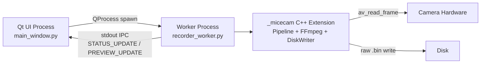
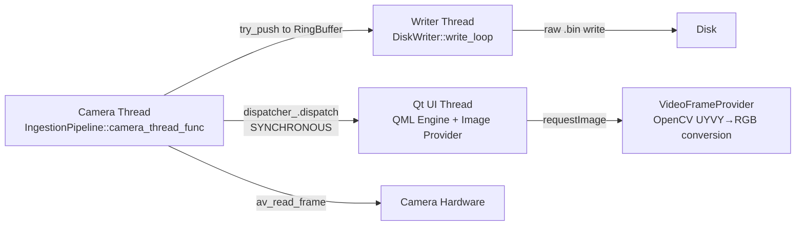

# Root Cause Analysis: Why the C++ Qt App Drops Frames

## TL;DR

The Python app **never drops frames** because it uses **process isolation**: the entire C++ capture/write pipeline runs in a **separate OS process**, completely decoupled from the UI. Our new C++ Qt app runs everything **in-process**, and the frame observer dispatch (preview) is synchronous and sits on the **critical capture path**.

---

## Architecture Comparison

### Python App (Zero Drops ✅)

**Key design decisions:**
1. **Process Isolation**: `RecorderThread` is actually a `QProcess` wrapper, NOT a thread. It spawns `recorder_worker.py` as a **separate OS process**.
2. **Zero UI coupling**: The worker process runs `_micecam.Pipeline` (C++ extension) directly. The capture loop has **zero interaction** with any UI code.
3. **Best-effort preview via IPC**: Preview frames are sent as base64-encoded strings over `stdout`. If the UI is slow to parse them, they just queue up in the pipe buffer — **the capture thread never waits**.
4. **Preview is throttled to 5 FPS**: The callback in `recorder_worker.py` (line 70) uses `min_interval = 1.0 / 5.0` and skips frames by timestamp. Even the Y-channel extraction + base64 encoding only happens at 5 FPS.
5. **Preview is lossy by design**: If the `preview_queue` (maxsize=1) is full, the old frame is drained and replaced (lines 213-223). No blocking ever occurs.

### C++ Qt App (10-27% Drops ❌)

**What goes wrong:**
1. **In-process observer dispatch**: `dispatcher_.dispatch(view)` in `camera_thread_func` (line 127) calls `VideoFrameProvider::on_frame()` **synchronously** on the capture thread.
2. **Heavy computation on capture thread**: Even with our async refactor, `on_frame()` still does a `data.assign()` (memcpy of ~4MB for 1080p UYVY) while holding the mutex. This blocks the capture thread.
3. **Ring buffer is too small**: `SessionConfig::ring_buffer_size = 10` (line 26 of `disk_writer.h`). At 1080p UYVY (4MB/frame × 30fps = 120MB/s), 10 frames = 40MB buffer. If either the writer or observer stalls, 10 frames fill up in ~333ms.
4. **No format negotiation with AVFoundation**: The FFmpeg backend requests `vcodec=mjpeg` (line 52 of `ffmpeg_camera_backend.cpp`), but AVFoundation overrides to `uyvy422`. This means:
   - We get **uncompressed** UYVY frames (~4MB each at 1080p) instead of compressed MJPEG (~100-300KB each).
   - This is **10-40x more data** flowing through the pipeline.
   - This is also **10-40x more I/O** to disk.

---

## Root Causes (Ranked by Impact)

| # | Cause | Impact | Python App Fix |
|---|-------|--------|----------------|
| 1 | **No MJPEG negotiation on Mac** | UYVY is 10-40x larger than MJPEG. Every pipeline stage (ring buffer, memcpy, disk I/O) is overwhelmed. | Python app also gets UYVY, but the C++ core handles it natively without extra copies. |
| 2 | **Synchronous observer dispatch on capture thread** | `on_frame()` blocks capture while copying 4MB of frame data. | Python app uses IPC (stdout), completely decoupled from capture. |
| 3 | **Ring buffer too small** | 10 frames × 4MB = 40MB. At 120MB/s throughput, this fills in 333ms during any stall. | Python `_micecam.Pipeline` likely uses larger buffers or the C++ extension has its own internal handling. |
| 4 | **Disk I/O for raw UYVY is heavy** | Writing 120MB/s of uncompressed data to an SSD (vs ~3-9MB/s for MJPEG). | Same issue exists in Python, but fewer stalls due to process isolation. |

---

## What We Did (Timeline)

| Step | What | Outcome |
|------|------|---------|
| 1 | Ported Python UI to C++ Qt/QML | UI works, but in-process architecture introduced coupling |
| 2 | Fixed QML syntax errors (duplicate IDs, missing braces) | App launches |
| 3 | Fixed live preview (UYVY→RGB via OpenCV) | Preview works but blocks capture thread |
| 4 | Fixed `get_frame()` infinite loop (never returned frames) | Frames now flow, but drops appear |
| 5 | Added `UYVY422` to `PixelFormat` enum | Correct format tagging |
| 6 | Added `pixel_format` to `DiskWriter` metadata | Decoder can now handle raw UYVY |
| 7 | Moved preview conversion to async worker thread | Reduced but did not eliminate drops |
| 8 | Updated Python decoder for UYVY→JPEG conversion | Post-processing works |

---

## Recommended Fix Strategy

### Option A: Match Python Architecture (Process Isolation)
Instead of running `IngestionPipeline` in-process, spawn `recorder_worker.py` (or a new C++ worker binary) via `QProcess`, exactly like the Python app does. The Qt UI only handles display and IPC.

- **Pros**: Proven zero-drop. Minimal code changes.
- **Cons**: Still depends on Python for the worker (or needs a separate C++ executable).

### Option B: Fix In-Process Architecture (Proper Decoupling)
1. **Increase ring buffer** to 200+ frames.
2. **Remove observer dispatch from capture thread entirely**. Instead, have the preview thread independently sample frames from the ring buffer (or a separate single-slot atomic buffer).
3. **Negotiate MJPEG with AVFoundation** by setting `pixel_format` option to `uyvy422` explicitly (avoiding the fallback path) or by removing `vcodec=mjpeg` and letting the device choose natively. Better yet, try to force MJPEG if the device supports it.

### Option C: Hybrid (Recommended)
1. Keep in-process for simplicity.
2. **Fix the FFmpeg backend to properly request MJPEG** (if camera supports it — most Mac webcams do via `avfoundation`).
3. **Create a dedicated single-slot atomic frame buffer** for the preview instead of using the observer pattern.
4. **Increase ring buffer** to ≥100 frames.

> [!IMPORTANT]
> The single biggest win will likely be **negotiating MJPEG format** with AVFoundation. This reduces per-frame size from ~4MB to ~200KB, which eliminates the I/O and memory pressure that causes drops.
