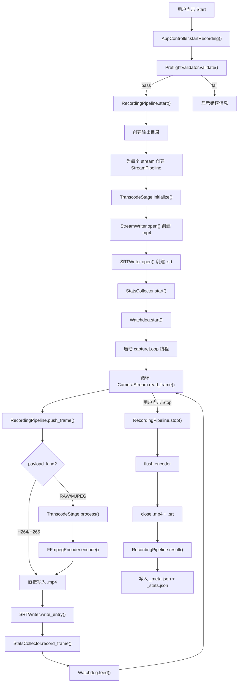
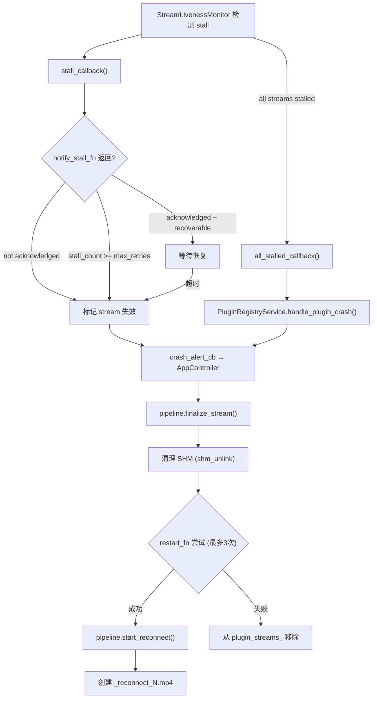
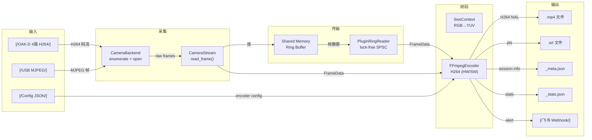
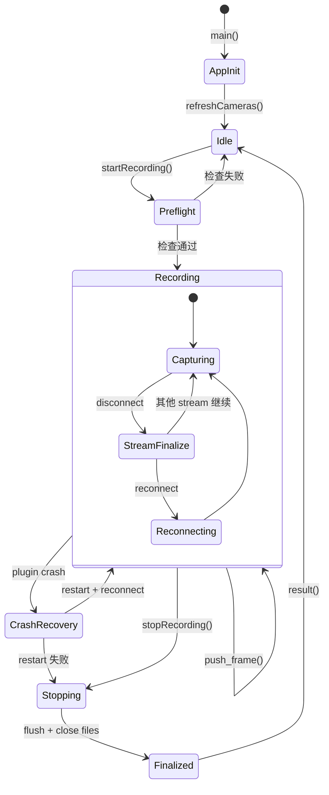
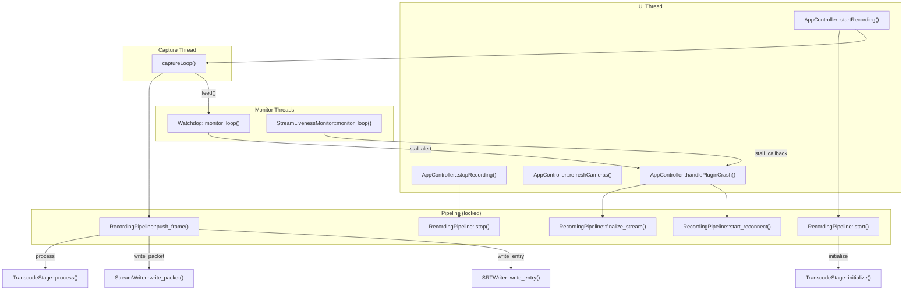

# MiceCam v2 — 项目语义图谱 (Project Atlas)

> 生成日期: 2026-05-22 | 基于 spec `001-micecam-v2-rewrite` 全量代码审计
> 模块级 atlas: [atlas/internal/domain/MODULE_ATLAS.md](internal/domain/MODULE_ATLAS.md) · [atlas/internal/pipeline/MODULE_ATLAS.md](internal/pipeline/MODULE_ATLAS.md) · [atlas/internal/infrastructure/MODULE_ATLAS.md](internal/infrastructure/MODULE_ATLAS.md) · [atlas/cmd/micecam_ui/MODULE_ATLAS.md](cmd/micecam_ui/MODULE_ATLAS.md)

---

## S0: 项目一屏摘要

| 模块 | 文件数 | 总行数 | 类/结构数 | 公开API | 状态复杂度 | 副作用复杂度 | 最高风险 | 测试覆盖 |
|------|--------|--------|-----------|---------|-----------|-------------|---------|---------|
| `internal/domain` | 20 | ~985 | 27 | 30 | 低 | 低 | 中 (裸指针) | 部分UT |
| `internal/pipeline` | 7 | ~1100 | 9 | 22 | 中 | 中 | 中 (mutex) | 较好UT |
| `internal/infrastructure` | 23 | ~3500 | 20 | ~60 | 高 | 高 | 高 (线程安全) | 部分UT+HIL |
| `cmd/micecam_ui` | 9 | ~1800 | 8 | ~50 | 高 | 高 | 高 (数据竞争) | MockModel仅 |
| **总计** | **59** | **~7385** | **64** | **~162** | — | — | — | — |

---

## S1: 项目架构图

```mermaid
flowchart TD
    subgraph UI["cmd/micecam_ui (Qt/QML)"]
        MAIN["main.cpp"]
        AC["AppController"]
        ASM["AppSettings"]
        ACM["AppCameraModel"]
        AAM["AppAlertModel"]
        CSM["CameraSourceModel"]
        MCM["MockCameraModel"]
    end

    subgraph PIPELINE["internal/pipeline"]
        RP["RecordingPipeline"]
        TS["TranscodeStage"]
        SC["StatsCollector"]
        PV["PreflightValidator"]
        IENC["IEncoder"]
        ISC["IStatsCollector"]
        ISW["IStreamWriter"]
    end

    subgraph INFRA["internal/infrastructure"]
        CM["CameraManager"]
        FCB["FFmpegCameraBackend"]
        OCB["OAKCameraBackend"]
        MCB["MockCameraBackend"]
        FE["FFmpegEncoder"]
        HES["HardwareEncoderSelector"]
        SW["StreamWriter"]
        SRT["SRTWriter"]
        MW["MetadataWriter"]
        WD["Watchdog"]
        AM["AlertManager"]
        FW["FeishuWebhook"]
        RM["ResourceManager"]
        PRS["PluginRegistryService"]
        PRR["PluginRingReader"]
        PSC["PluginStreamConsumer"]
        SLM["StreamLivenessMonitor"]
        SMB["SharedMemoryBackend"]
        CL["ConfigLoader"]
        LPC["LinkedPluginConfig"]
    end

    subgraph DOMAIN["internal/domain"]
        TE["TimestampEngine"]
        SS["StreamStats"]
        SM["SessionMetadata"]
        PM["PluginManifest"]
        PR["PluginRegistry"]
        PER["PluginErrorRegistry"]
    end

    MAIN --> AC
    AC --> CM
    AC --> RP
    AC --> PRS
    AC --> ASM
    AC --> ACM
    AC --> AAM
    AC --> CSM

    AC --> PV

    RP --> TS
    RP --> SW
    RP --> SRT
    RP --> SC
    RP --> MW
    RP --> WD
    RP --> AM

    TS --> FE
    FE --> HES

    CM --> FCB
    CM --> OCB
    CM --> MCB

    PRS --> LPC
    PRS --> SLM
    PRS --> PM
    PRS --> PER

    PSC --> PRR
    PSC --> RP
    PSC --> SLM

    PRR --> SMB

    AM --> FW

    ASM --> CL

    RP --> TE
    RP --> SS
    RP --> SM
```



---

## S2: 核心端到端流程

### US-001: 多相机录制流程



### US-002: 插件崩溃恢复流程



---

## S3: 数据流图



---

## S4: 全局状态机



---

## S5: 跨模块调用图



---

## S6: 全局状态变量汇总

| 模块 | 变量 | 类型 | 跨线程 | 保护机制 | 风险 |
|------|------|------|--------|---------|------|
| RecordingPipeline | `state_` | atomic | 是 | atomic | 低 |
| RecordingPipeline | `mutex_` | mutex | 是 | lock_guard | 中 (持有锁时写文件) |
| RecordingPipeline | `streams_` | map | 是 | mutex_ | 低 |
| StatsCollector | `mutex_` + 8个计数器 | mutex | 是 | lock_guard | 低 |
| TimestampEngine | `mutex_` + 2个clock | mutex | 是 | lock_guard | 低 |
| FFmpegEncoder | `enc_ctx_` + `sws_ctx_` | 裸指针 | **否** | **无** | **高** |
| ConfigLoader | 18个设置字段 | 值类型 | **否** | **无** | 中 |
| Watchdog | `running_` + `last_feed_ns_` | atomic | 是 | atomic | 低 |
| AlertManager | `mutex_` + history | mutex | 是 | lock_guard | 低 |
| StreamLivenessMonitor | `running_` + mutex | mixed | 是 | atomic+mutex | 低 |
| PluginRingReader | `mapped_mem_` + stats | 裸指针+mutex | 是 | mutex (stats only) | 中 |
| PluginRegistryService | `registry_mutex_` + 4个map | mutex | 是 | lock_guard | 中 |
| AppController | `total_frames_` | uint64_t | **是** | **无** | **高** |
| AppController | `bytes_written_` | uint64_t | **是** | **无** | **高** |
| AppController | `stream_frame_counts_` | map | **是** | **无** | **高** |
| AppController | `active_streams_` | vector | **是** | **无** | **高** |
| AppController | `capture_running_` | atomic | 是 | atomic | 低 |

---

## S7: 跨模块接口契约

| 接口 | 提供者 | 消费者 | 方法 | 线程安全 | 代码证据 |
|------|--------|--------|------|---------|---------|
| `ICameraBackend` | FCB/OCB/MCB | CameraManager | enumerate_devices(), open_stream() | 否 (调用者加锁) | `CameraManager.cpp:L23-L32` |
| `IEncoder` | FFmpegEncoder | TranscodeStage | initialize(), encode(), flush() | **否** | `FFmpegEncoder.cpp` 无mutex |
| `IStreamWriter` | StreamWriter | RecordingPipeline | open(), write_packet(), close() | 是 (内部mutex) | `StreamWriter.cpp:L46` |
| `IStatsCollector` | StatsCollector | RecordingPipeline | record_frame(), finalize() | 是 (内部mutex) | `StatsCollector.cpp:L22` |
| `WatchdogObserver` | FeishuWebhook | AlertManager | on_alert() | 是 (AlertManager调用) | `FeishuWebhook.cpp:L28` |
| `ICalibrationClient` | 外部注入 | PreflightValidator | calibrate() | 由实现决定 | `PreflightValidator.h:L68` |

---

## S8: 线程模型副作用矩阵

| 组件 | UI Thread | Capture Thread | Watchdog Thread | Monitor Thread |
|------|-----------|---------------|-----------------|----------------|
| AppController | 读写全部属性 | 读写 total_frames_ (竞争) | 通过 QMetaObject 调用 | 通过 QMetaObject 调用 |
| RecordingPipeline | start/stop/result | push_frame (mutex) | feed (atomic) | — |
| FFmpegEncoder | — | encode (无锁) | — | — |
| StreamWriter | — | write_packet (mutex) | — | — |
| PluginRingReader | — | readNextFrame | — | — |
| PluginRegistryService | register/unregister | — | — | crash handling (mutex) |

---

## S9: 项目级风险矩阵

| # | 风险 | 涉及模块 | 严重度 | 代码证据 | 建议行动 |
|---|------|---------|--------|---------|---------|
| R1 | AppController 数据竞争 | micecam_ui | **高** | `total_frames_`/`bytes_written_`/`active_streams_` 在 captureLoop 和 UI 线程间无同步 | [高优先] 加 mutex 或改为 atomic |
| R2 | FFmpegEncoder 线程不安全 | infrastructure | **高** | 无 mutex, enc_ctx_/sws_ctx_ 裸指针 | [高优先] 若多流并发调用需加锁 |
| R3 | FeishuWebhook::send() 空壳 | infrastructure | **高** | `FeishuWebhook.cpp:L79` return true | [高优先] 实现 HTTP POST |
| R4 | AppController 析构不停止 capture | micecam_ui | **高** | 析构函数未调用 stopCaptureLoop() | [高优先] 加析构守卫 |
| R5 | TimestampEngine 无初始化守卫 | domain | **中** | populate() 在 capture_wall_anchor() 前调用返回未定义值 | [中优先] 加 initialized flag |
| R6 | PluginRingReader checksum 弱 | infrastructure | **中** | XOR 前 256 字节, `PluginRingReader.cpp:L93` | [中优先] 升级为 CRC32 |
| R7 | PluginErrorRegistry::get() 抛异常 | domain | **中** | `PluginErrorRegistry.cpp:L98` throw runtime_error | [中优先] 改为返回 optional 或 ErrorResult |
| R8 | PluginRegistryService::handle_plugin_crash 自锁 | infrastructure | **中** | stall_callback 在 registry_mutex_ 内触发, crash 处理又获取 registry_mutex_ | [中优先] 分离锁或异步处理 |
| R9 | ConfigLoader 每次写入全量 JSON | infrastructure | **低** | save() 每次完整序列化 | [低优先] 性能问题, 可后续优化 |
| R10 | SessionMetadata to_json/from_json 不对称 | domain | **低** | from_json 不恢复 keyframe_interval | [低优先] 按需修复 |

---

## S10: 需求符合性矩阵

| FR | 需求 | 涉及模块 | 状态 | 证据 |
|----|------|---------|------|------|
| FR-001 | Plugin backend system | domain+infra | ✅ 完整实现 | PluginRegistry + ICameraBackend + IDeviceEnumerator |
| FR-002 | CameraStream abstraction | domain | ✅ 完整实现 | 虚基类 + FFmpegCameraStream + OAKCameraStream |
| FR-003 | Transcode stage | pipeline | ✅ 完整实现 | TranscodeStage + FFmpegEncoder + hardware fallback |
| FR-004 | Multi-stream MP4 output | pipeline+infra | ✅ 完整实现 | StreamWriter per stream |
| FR-005 | SRT subtitle track | infra | ✅ 完整实现 | SRTWriter per stream |
| FR-006 | Session metadata JSON | domain+infra | ✅ 完整实现 | SessionMetadata + MetadataWriter |
| FR-007 | Session statistics JSON | domain+pipeline+infra | ✅ 完整实现 | StatsCollector + MetadataWriter |
| FR-008 | Timestamp system | domain | ✅ 完整实现 | TimestampEngine (system+steady clock) |
| FR-009 | Watchdog mechanism | infra | ✅ 完整实现 | Watchdog + configurable timeout |
| FR-010 | Alert types | domain | ⚠️ 部分实现 | AlertType 7 种定义完整, 但触发逻辑分散 |
| FR-011 | Preflight validation | pipeline | ✅ 完整实现 | PreflightValidator 5 阶段 |
| FR-012 | spdlog async logging | 全局 | ✅ 完整实现 | 各模块均使用 spdlog |
| FR-013 | Fault recovery | pipeline+infra+ui | ⚠️ 部分实现 | finalize_stream + reconnect 存在, 但缺少 corrupted frame skip 标记 |
| FR-014 | Hardware resource lock | domain+infra | ✅ 完整实现 | ResourceManager exclusive_resource_id |
| FR-015 | Cross-platform build | 全局 | ⚠️ 未完全验证 | macOS 确认, Windows/Linux 有代码路径但 HIL 仅部分通过 |

**FR 覆盖率: 12/15 完整实现, 3/15 部分实现**

---

## S11: 图表覆盖率矩阵

| 代码元素 | S1 架构 | S2 流程 | S3 数据流 | S4 状态机 | S5 调用图 | S6 状态 | S7 契约 | S8 副作用 | S9 风险 | 覆盖度 |
|---------|---------|---------|----------|----------|----------|---------|---------|----------|---------|--------|
| RecordingPipeline | ✅ | ✅ | ✅ | ✅ | ✅ | ✅ | ✅ | ✅ | — | 完整 |
| AppController | ✅ | ✅ | — | ✅ | ✅ | ✅ | — | ✅ | ✅ | 完整 |
| FFmpegEncoder | ✅ | — | ✅ | — | ✅ | ✅ | ✅ | ✅ | ✅ | 完整 |
| PluginRegistryService | ✅ | ✅ | — | ✅ | ✅ | ✅ | — | ✅ | ✅ | 完整 |
| PluginRingReader | ✅ | — | ✅ | — | ✅ | ✅ | — | ✅ | ✅ | 完整 |
| Watchdog | ✅ | — | — | ✅ | ✅ | ✅ | — | ✅ | — | 部分 |
| StreamWriter | ✅ | — | ✅ | — | ✅ | ✅ | ✅ | ✅ | — | 完整 |
| CameraManager | ✅ | — | ✅ | — | ✅ | — | ✅ | — | — | 部分 |
| TimestampEngine | ✅ | — | ✅ | — | ✅ | ✅ | — | — | ✅ | 完整 |
| PreflightValidator | ✅ | ✅ | — | — | ✅ | — | — | — | — | 部分 |

总元素数 10, 完整覆盖 6, 部分覆盖 4, 未覆盖 0

---

## S12: 核心伪代码

### P1: AppController.startRecording()

```
1. 如果 recording_ == true, 返回 false
2. 如果 camera_model_ 行数 == 0, 设置错误消息, 返回 false
3. 生成 session_id = "session_" + system_clock::now()
4. 构建 SessionConfig:
   a. 设置 output_dir
   b. 遍历 discover_all() 的每个 device/stream, 构建 StreamConfig
5. 调用 pipeline_.start(config) — 如果失败, 返回 false
6. 遍历 config.streams, 调用 manager_.open_stream() 构建 active_streams_
7. 设置 capture_running_ = true, 启动 capture_thread_
8. 设置 recording_ = true, 启动 metrics_timer_
9. 发射所有 isRecordingChanged/canStartRecordingChanged 信号
10. 返回 true
```

### P2: captureLoop()

```
1. 循环: 当 capture_running_ == true
2.   遍历 active_streams_:
3.     调用 stream->read_frame(bytes, pts)
4.     如果失败, continue
5.     构建 FrameData{stream_id, data, size, pts, source_format}
6.     调用 pipeline_.push_frame(frame)
7.     如果成功:
8.       total_frames_++ (⚠️ 无锁, 与 UI 线程竞争)
9.       bytes_written_ += bytes.size() (⚠️ 无锁)
10.      stream_frame_counts_[sid]++ (⚠️ 无锁)
11.  QMetaObject::invokeMethod(refreshLiveStatus, QueuedConnection)
12.  sleep 33ms
```

### P3: PluginRegistryService.handle_plugin_crash()

```
1. 获取 registry_mutex_ (⚠️ 可能与 stall_callback 死锁)
2. 获取 plugin 的 streams 列表
3. 遍历 streams: 记录 finalized_streams
4. 获取 plugin 的 shm_names 列表
5. 遍历 shm_names: 调用 shm_unlink_fn_(), 记录 cleaned_shm_names
6. 从 plugin_shm_names_ 中移除该 plugin
7. 如果 restart_fn_ 存在:
8.   最多重试 max_restart_retries_ (3) 次
9.   如果成功: restart_succeeded = true
10.  如果失败: 从 plugin_streams_ 移除该 plugin
11. 返回 CrashRecoveryResult
```

---

## S13: 最终审计结论

### 总体评估

| 维度 | 评分 | 说明 |
|------|------|------|
| 架构清晰度 | 8/10 | 四层分离明确, 接口抽象合理 |
| 线程安全 | 4/10 | 5处数据竞争, 2处锁不完整 |
| 需求符合度 | 8/10 | 12/15 FR 完整实现 |
| 代码质量 | 7/10 | 命名清晰, 但缺少防御性编程 |
| 测试覆盖 | 3/10 | 后端有 UT, UI 层几乎无测试 |
| **综合** | **6/10** | |

### 关键发现

1. **AppController 存在 5 处数据竞争** — `total_frames_`/`bytes_written_`/`stream_frame_counts_`/`stream_drop_counts_`/`active_streams_` 在 capture 线程和 UI 线程之间无任何同步机制
2. **FFmpegEncoder 线程不安全** — 无 mutex 保护, 如果未来多流并行编码将导致 FFmpeg C API 上下文冲突
3. **FeishuWebhook::send() 是空壳** — 核心告警通道未实现, 生产环境下所有告警静默丢失
4. **PluginRegistryService 锁嵌套风险** — stall_callback 在 registry_mutex_ 持有时触发, 最终回调可能再次获取同一把锁
5. **UI 层测试覆盖率 ≈ 0%** — 仅 MockCameraModel 存在, 无 AppController/Model 的自动化测试

### 建议行动

| 优先级 | 行动 | 涉及文件 | 预估工时 |
|--------|------|---------|---------|
| **[高优先]** | 为 AppController 竞争变量加 atomic 或 mutex | `AppController.h` | 2h |
| **[高优先]** | 实现 FeishuWebhook::send() HTTP POST | `FeishuWebhook.cpp` | 3h |
| **[高优先]** | AppController 析构函数加 stopCaptureLoop() | `AppController.cpp` | 0.5h |
| **[高优先]** | FFmpegEncoder 加 mutex 或文档标注单线程约束 | `FFmpegEncoder.h` | 1h |
| **[中优先]** | TimestampEngine 加 initialized 守卫 | `TimestampEngine.h/.cpp` | 1h |
| **[中优先]** | PluginRingReader checksum 升级 CRC32 | `PluginRingReader.cpp` | 1h |
| **[中优先]** | PluginRegistryService 分离锁, 避免嵌套 | `PluginRegistryService.cpp` | 2h |
| **[中优先]** | 补充 AppController 单元测试 | `tests/ui/` | 4h |
| **[低优先]** | SessionMetadata from_json 补 keyframe_interval | `SessionMetadata.cpp` | 0.5h |
| **[低优先]** | PluginErrorRegistry::get() 改为 optional 返回 | `PluginErrorRegistry.h/.cpp` | 1h |
