# Module Semantic Atlas: `cmd/micecam_ui/`

> MiceCam v2 UI Layer — Qt/QML Desktop Application
> Generated: 2026-05-22
> Scope: main.cpp, AppController, AppSettings, AppCameraModel, AppAlertModel, CameraSourceModel, MockCameraModel, CameraPermissionHelper

---

## S0 — One-Screen Summary

| 维度 | 内容 |
|------|------|
| **模块定位** | Qt/QML 桌面应用 UI 层，连接底层 domain/infrastructure/pipeline 层与用户界面 |
| **核心类** | `AppController` (812行) — 中央控制器，25+ Q_PROPERTY、13 Q_INVOKABLE、后台采集线程 |
| **模型层** | `AppCameraModel` (相机网格)、`CameraSourceModel` (插件源)、`AppAlertModel` (告警流)、`AppSettings` (配置桥接) |
| **线程模型** | 主线程 (Qt事件循环) + capture_thread_ (后台帧采集，33ms轮询) |
| **关键交互** | QML ↔ AppController (Q_PROPERTY绑定 + Q_INVOKABLE调用)、captureLoop → pipeline (帧推送)、PluginRegistryService crash回调 → UI告警 |
| **外部依赖** | Qt 6 (QGuiApplication, QQuick, QML)、nlohmann_json、FFmpegCameraBackend、ConfigLoader、RecordingPipeline、PluginRegistryService、CameraManager |
| **文件清单** | main.cpp (23行), AppController.h/.cpp (159+812), AppSettings.h/.cpp (102+147), AppCameraModel.h/.cpp (58+79), AppAlertModel.h/.cpp (51+96), CameraSourceModel.h/.cpp (68+222), MockCameraModel.h/.cpp (43+72), CameraPermissionHelper.h/.mm/.stub (16+平台实现) |
| **风险等级** | **中高** — 多线程竞态(total_frames_/bytes_written_无互斥锁)、capture线程生命周期管理、QML属性变更信号风暴 |

---

## S1 — Module Framework: Qt Signal/Slot Connections

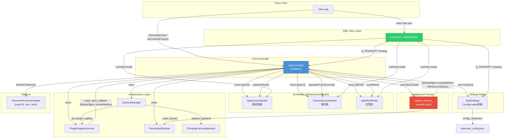

### Signal/Slot 连接表

| 信号源 | 信号 | 连接目标 | 连接方式 |
|--------|------|----------|----------|
| `QTimer (metrics_timer_)` | `timeout()` | `AppController::pushLiveMetrics()` | `connect()` lambda |
| `PluginRegistryService` | crash callback | `AppController::handlePluginCrash()` | `set_crash_alert_callback` + `QMetaObject::invokeMethod` |
| `captureLoop` (bg thread) | — | `AppController::refreshLiveStatus()` | `QMetaObject::invokeMethod(Qt::QueuedConnection)` |
| `AppSettings` 各setter | 18个 `*Changed()` signals | QML bindings | Qt Q_PROPERTY auto-connection |
| `AppController` | `isRecordingChanged()` 等15个 | QML bindings | Qt Q_PROPERTY auto-connection |
| `AppAlertModel` | `badgeCountChanged()` | QML badge indicator | Qt Q_PROPERTY auto-connection |

---

## S2 — Core Flows

### 2.1 startRecording()

```mermaid
sequenceDiagram
    participant QML as QML UI
    participant AC as AppController
    participant CM as CameraManager
    participant RP as RecordingPipeline
    participant CT as capture_thread_
    participant MT as metrics_timer_

    QML->>AC: startRecording()
    AC->>AC: guard: recording_ == false && cameraCount > 0
    AC->>AC: generate session_id_ from epoch nanos
    AC->>AC: build SessionConfig with all device streams
    AC->>RP: pipeline_.start(config)
    alt pipeline start failed
        RP-->>AC: return false
        AC-->>QML: return false
    end
    AC->>CM: open_stream() for each StreamConfig
    CM-->>AC: unique_ptr&lt;CameraStream&gt; per stream
    AC->>AC: populate active_streams_
    AC->>CT: launch capture_thread_ with captureLoop()
    AC->>AC: session_start_ = now
    AC->>AC: recording_ = true
    AC->>MT: metrics_timer_->start(1000ms)
    AC->>QML: emit isRecordingChanged() + canStartRecordingChanged() + recordButtonTextChanged() + lastSessionIdChanged()
    AC-->>QML: return true
```

### 2.2 captureLoop() (Background Thread)

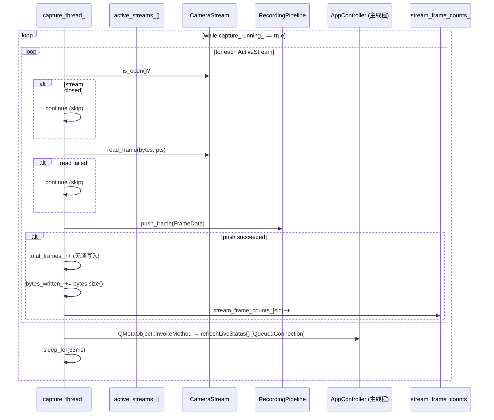

### 2.3 handlePluginCrash() (Crash Recovery)

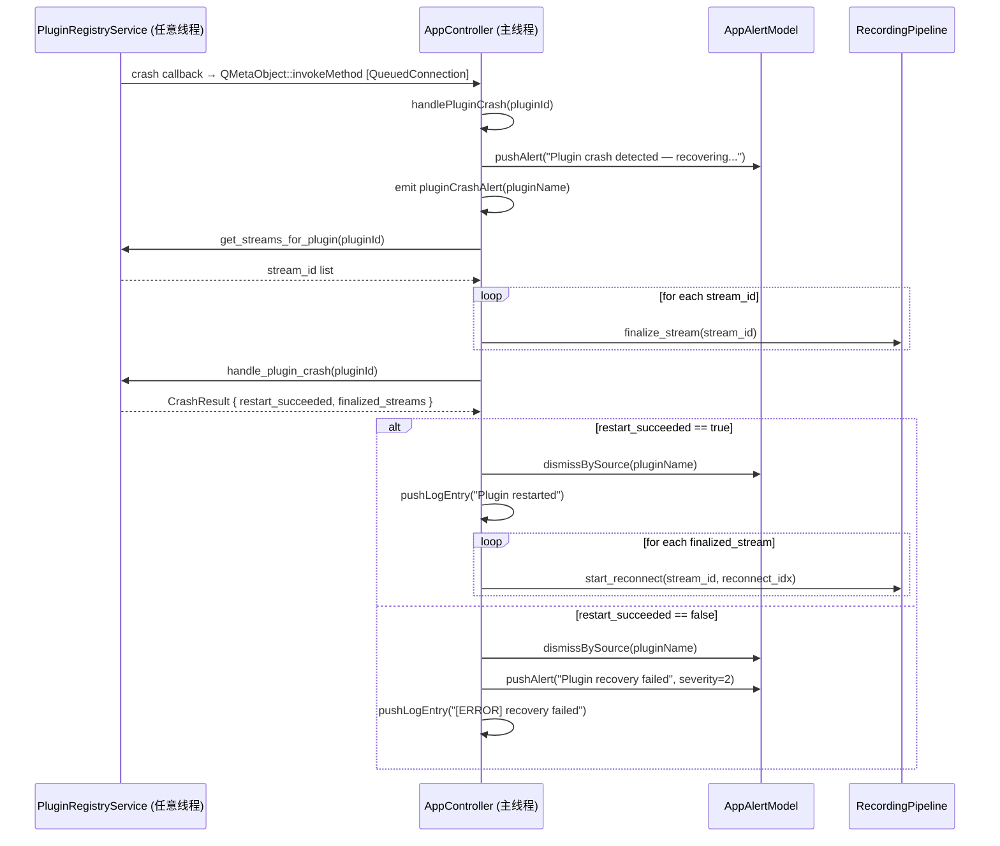

---

## S3 — Data Flow

### 3.1 CameraManager → AppCameraModel → QML

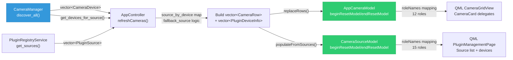

### 3.2 captureLoop → Pipeline → QML Properties

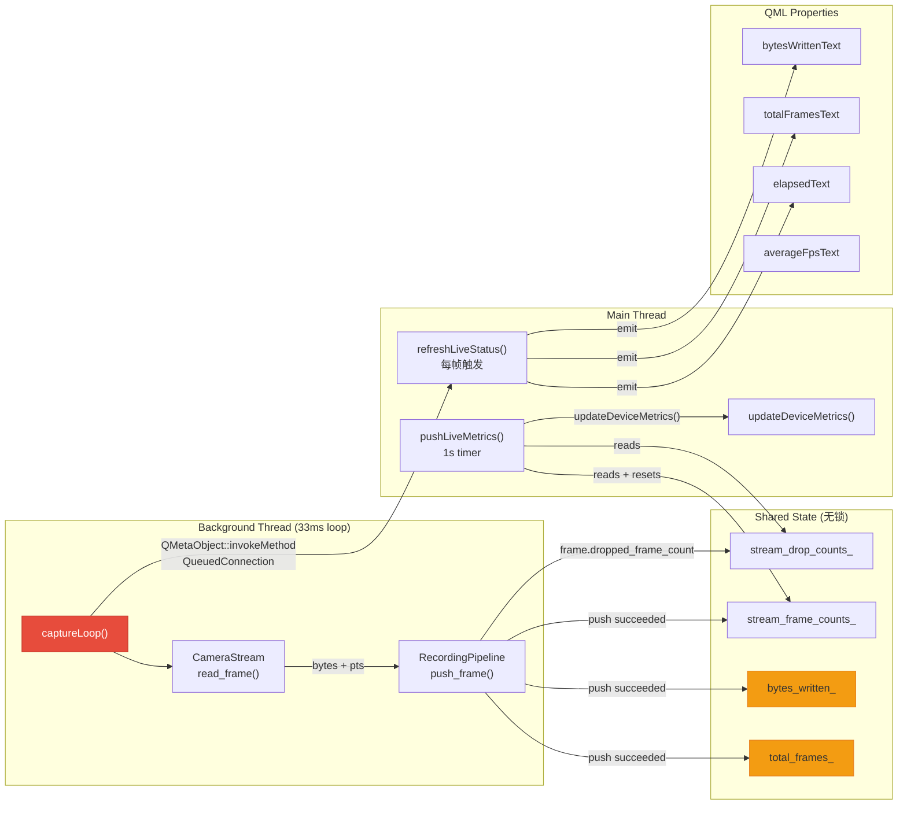

### 3.3 AppSettings Data Flow

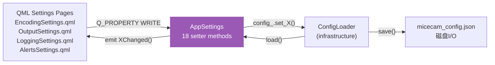

---

## S4 — State Machine

### 4.1 App Lifecycle State Machine

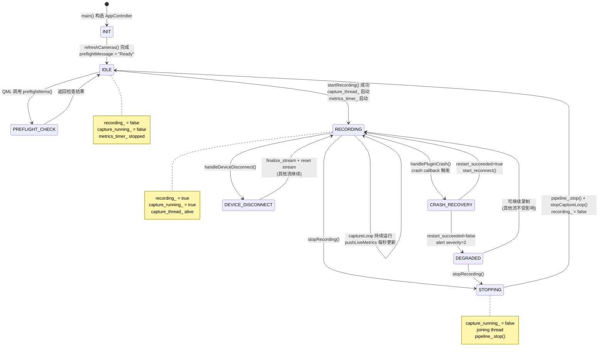

### 4.2 Plugin Crash Recovery Sub-State

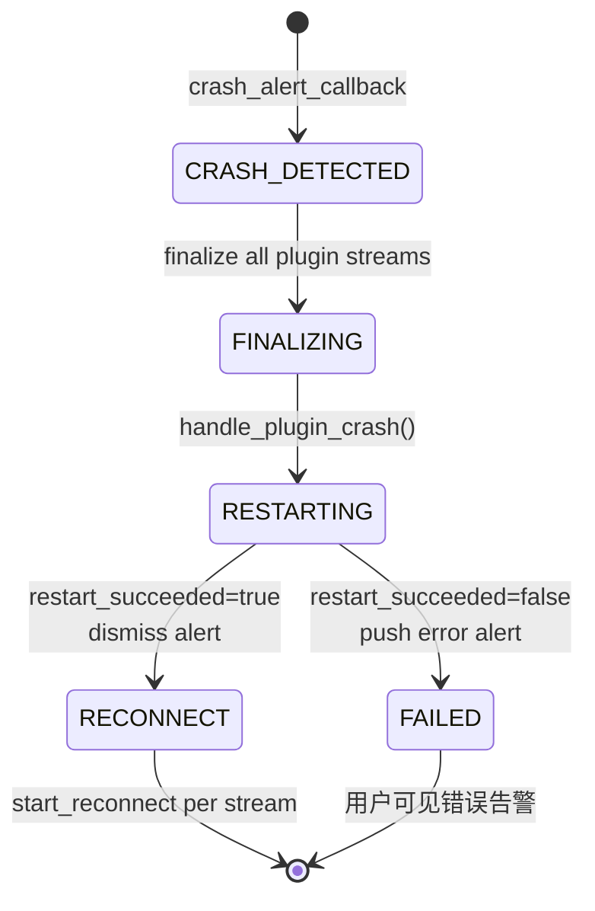

---

## S5 — Call Graph

```mermaid
graph TD
    subgraph "QML Entry Points (Q_INVOKABLE)"
        RC["refreshCameras()"]
        SR["startRecording()"]
        STR["stopRecording()"]
        PI["preflightItems()"]
        CA["cameraAt(int)"]
        PL["pluginList()"]
        IP["importPlugin(dirPath)"]
        TP["togglePlugin(path, enabled)"]
        RP2["removePlugin(path)"]
        GPD["getPluginDetail(path)"]
    end

    subgraph "Q_PROPERTY Getters (QML绑定)"
        IR["isRecording()"]
        RBT["recordButtonText()"]
        CSR["canStartRecording()"]
        CC["cameraCount()"]
        CCT["cameraCountText()"]
        ET["elapsedText()"]
        TFT["totalFramesText()"]
        AFT["averageFpsText()"]
        BWT["bytesWrittenText()"]
        DRT["diskRemainingText()"]
        PM["preflightMessage()"]
        LSI["lastSessionId()"]
        CEN["currentEncoderName()"]
        CB["currentBitrate()"]
        AV["appVersion()"]
        BD["buildDate()"]
        RLE["recentLogEntries()"]
        CM_R["cameraModel()"]
        SM_R["sourceModel()"]
        AM_R["alertModel()"]
        S_R["settings()"]
    end

    subgraph "Internal Methods"
        CL["captureLoop()"]
        SCL["stopCaptureLoop()"]
        RLS["refreshLiveStatus()"]
        PLM["pushLiveMetrics()"]
        SCAH["setupCrashAlertHandler()"]
        HPC["handlePluginCrash()"]
        HDD["handleDeviceDisconnect()"]
    end

    subgraph "Infrastructure Delegates"
        CM_DISC["CameraManager::discover_all()"]
        CM_SRC["CameraManager::get_sources()"]
        CM_OPEN["CameraManager::open_stream()"]
        CM_DEV["CameraManager::get_devices_for_source()"]
        PRS_INIT["PluginRegistryService::initialize()"]
        PRS_SRC["PluginRegistryService::getSources()"]
        PRS_CRASH["PluginRegistryService::handle_plugin_crash()"]
        PRS_STREAMS["PluginRegistryService::get_streams_for_plugin()"]
        RP_START["RecordingPipeline::start()"]
        RP_STOP["RecordingPipeline::stop()"]
        RP_PUSH["RecordingPipeline::push_frame()"]
        RP_FINAL["RecordingPipeline::finalize_stream()"]
        RP_RECONN["RecordingPipeline::start_reconnect()"]
        RP_RESULT["RecordingPipeline::result()"]
        CPH["micecam_request_camera_access()"]
        PV["PreflightValidator::check_disk_space()"]
    end

    RC --> CPH
    RC --> CM_DISC
    RC --> CM_SRC
    RC --> CM_DEV

    SR --> CM_DISC
    SR --> RP_START
    SR --> CM_OPEN
    SR --> CL
    SR --> PLM

    STR --> SCL
    STR --> RP_STOP
    STR --> RP_RESULT

    PI --> PV

    PL --> PRS_SRC
    IP --> PRS_SRC
    TP --> PRS_SRC
    RP2 --> PRS_SRC

    GPD --> PRS_SRC
    GPD --> CM_DEV

    CL --> RP_PUSH
    CL --> RLS

    PLM --> CM_DEV

    HPC --> PRS_STREAMS
    HPC --> RP_FINAL
    HPC --> PRS_CRASH
    HPC --> RP_RECONN

    HDD --> RP_FINAL

    SCAH --> PRS_CRASH

    TFT --> IR
    RBT --> IR
    CSR --> IR
    CCT --> CC

    style RC fill:#3498db,stroke:#2980b9,color:#fff
    style SR fill:#e74c3c,stroke:#c0392b,color:#fff
    style STR fill:#e74c3c,stroke:#c0392b,color:#fff
    style CL fill:#e74c3c,stroke:#c0392b,color:#fff
```

---

## S6 — State Inventory

| 变量 | 类型 | 所属类 | 初始值 | 线程安全 | 用途 |
|------|------|--------|--------|----------|------|
| `recording_` | `bool` | AppController | `false` | **否** (仅主线程写) | 录制状态标志，QML绑定源 |
| `capture_running_` | `atomic<bool>` | AppController | `false` | **是** (atomic) | capture线程退出信号 |
| `capture_thread_` | `std::thread` | AppController | 默认 | N/A | 后台帧采集线程 |
| `session_id_` | `QString` | AppController | `""` | 否 (主线程) | 当前录制会话ID |
| `session_start_` | `steady_clock::time_point` | AppController | 默认(epoch) | 否 (主线程) | 录制开始时间，elapsedText计算源 |
| `total_frames_` | `uint64_t` | AppController | `0` | **否** (capture线程写/主线程读) | **竞态风险** — 无互斥保护 |
| `bytes_written_` | `uint64_t` | AppController | `0` | **否** (capture线程写/主线程读) | **竞态风险** — 无互斥保护 |
| `average_fps_` | `double` | AppController | `0.0` | 否 (仅主线程) | 平均帧率 |
| `disk_remaining_` | `QString` | AppController | `""` | 否 (仅主线程) | 磁盘剩余空间显示 |
| `preflight_message_` | `QString` | AppController | `""` | 否 (仅主线程) | 预检消息 |
| `current_encoder_name_` | `QString` | AppController | `"—"` | 否 (仅主线程) | 当前编码器名称 |
| `current_bitrate_` | `QString` | AppController | `"—"` | 否 (仅主线程) | 当前码率 |
| `app_version_` | `QString` | AppController | `"0.0.0"` | 否 (构造后不变) | 应用版本号 |
| `build_date_` | `QString` | AppController | `"unknown"` | 否 (构造后不变) | 构建日期 |
| `active_streams_` | `vector<ActiveStream>` | AppController | 空 | **否** (capture线程读/主线程写) | **竞态风险** — 无互斥保护 |
| `log_entries_` | `QStringList` | AppController | 空 | **否** (多线程写) | **竞态风险** — capture线程和crash回调均可触发写入 |
| `metrics_timer_` | `QTimer*` | AppController | `nullptr` | 否 (仅主线程) | 1秒定时器驱动 pushLiveMetrics |
| `stream_frame_counts_` | `unordered_map<string,uint64_t>` | AppController | 空 | **否** (capture写/metrics读+清零) | **竞态风险** — 无互斥保护 |
| `stream_drop_counts_` | `unordered_map<string,uint64_t>` | AppController | 空 | **否** (capture写/metrics读) | **竞态风险** — 无互斥保护 |
| `last_metrics_push_` | `steady_clock::time_point` | AppController | 默认 | 否 (仅主线程) | 上次metrics推送时间 |
| `output_dir_` | `QString` | AppController | `""` | 否 (仅主线程) | 输出目录 |
| `rows_` (AppCameraModel) | `vector<CameraRow>` | AppCameraModel | 空 | 否 (仅主线程) | 相机行数据 |
| `rows_` (AppAlertModel) | `vector<AlertRow>` | AppAlertModel | 空 | 否 (仅主线程) | 告警行数据 |
| `rows_` (CameraSourceModel) | `vector<SourceRow>` | CameraSourceModel | 空 | 否 (仅主线程) | 源行数据 |
| `deviceMetrics_` | `unordered_map` | CameraSourceModel | 空 | 否 (仅主线程) | 设备实时指标 |
| `config_` | `ConfigLoader` | AppSettings | 默认 | 否 (仅主线程) | 配置加载/存储 |

### ActiveStream 结构

| 字段 | 类型 | 用途 |
|------|------|------|
| `config` | `domain::StreamConfig` | 流配置 (device_id, stream_index, width, height, framerate, pixel_format) |
| `stream` | `unique_ptr<CameraStream>` | 底层相机流对象，read_frame() 接口 |

### CameraRow 结构

| 字段 | 类型 | 用途 |
|------|------|------|
| `cameraId` | `QString` | 唯一标识 (device_id + "_" + stream_index) |
| `name` | `QString` | 显示名称 |
| `sourceId` | `QString` | 插件源ID |
| `sourceGroup` | `QString` | 源分组名称 |
| `resolutionLabels` | `QStringList` | 分辨率选项 |
| `framerateLabels` | `QStringList` | 帧率选项 |
| `formatLabels` | `QStringList` | 格式选项 |
| `alertMessage` | `QString` | 告警消息 |
| `fps` | `double` | 当前帧率 |
| `dropCount` | `int` | 丢帧数 |
| `status` | `int` | 0=可用, 2=不可用 |
| `recording` | `bool` | 是否录制中 |

### AlertRow 结构

| 字段 | 类型 | 用途 |
|------|------|------|
| `alertId` | `QString` | 告警唯一ID |
| `severity` | `int` | 0=Info, 1=Warning, 2=Error |
| `title` | `QString` | 告警标题 |
| `source` | `QString` | 来源标识 |
| `relativeTime` | `QString` | 相对时间 ("now") |
| `autoDismiss` | `bool` | 是否自动消失 |

---

## S7 — Function Contracts

### AppController

| 方法 | 参数 | 返回值 | 前置条件 | 后置条件 | 副作用 |
|------|------|--------|----------|----------|--------|
| `refreshCameras()` | 无 | void | 无 | cameraModel/sourceModel 更新；preflightMessage 更新 | 调用 micecam_request_camera_access()、discover_all()、get_sources() |
| `startRecording()` | 无 | `bool` | `recording_ == false` && `cameraCount > 0` | `recording_ == true`；capture_thread 运行；metrics_timer 运行 | 创建 session_id、启动 pipeline、开启后台线程、emit 4个信号 |
| `stopRecording()` | 无 | void | `recording_ == true` | `recording_ == false`；capture_thread 已join；pipeline 已stop | 聚合 stats、重置计数器、emit 8个信号 |
| `captureLoop()` | 无 | void | `capture_running_ == true` | `capture_running_ == false` 时退出 | 后台线程循环：read_frame → push_frame → update counters → invokeMethod(refreshLiveStatus) |
| `stopCaptureLoop()` | 无 | void | 无 | capture_thread 已join；active_streams 已清空 | 设置 capture_running_=false、join线程 |
| `preflightItems()` | 无 | `QVariantList` | 无 | 返回3项检查结果 | 调用 PreflightValidator::check_disk_space() |
| `cameraAt(int row)` | row index | `QVariantMap` | 0 <= row < rowCount | 返回12字段 QVariantMap | 无 |
| `pluginList()` | 无 | `QVariantList` | 无 | 返回所有插件的 QVariantMap 列表 | 无 |
| `importPlugin(dirPath)` | 目录路径 | `bool` | `recording_ == false` | 成功时插件添加到注册表 | 写 log、emit pluginsChanged |
| `togglePlugin(path, enabled)` | 路径+启用 | void | `recording_ == false`；非 bundled | 插件启用/禁用状态变更 | 写 log、emit pluginsChanged |
| `removePlugin(path)` | 路径 | `bool` | `recording_ == false`；LINKED 类型 | 插件从注册表移除 | 写 log、emit pluginsChanged |
| `getPluginDetail(path)` | 路径 | `QVariantMap` | plugin.json 存在 | 返回完整插件详情+设备列表 | 读取磁盘文件 |
| `handlePluginCrash(pluginId)` | plugin ID | void | crash callback 触发 | 尝试恢复或推送错误告警 | finalize streams、push alerts、可能 start_reconnect |
| `handleDeviceDisconnect(streamId, deviceName)` | 流ID+设备名 | void | 设备断开事件 | 流 finalized、active stream reset | push alert、emit deviceDisconnected |
| `pushLiveMetrics()` | 无 | void | `recording_ == true` | source model 更新设备指标 | 重置 stream_frame_counts_ |
| `refreshLiveStatus()` | 无 | void | 主线程 | log_entries 更新 | emit 4个信号 (elapsed/totalFrames/bytes/log) |

### AppSettings

| 方法 | 参数 | 返回值 | 前置条件 | 后置条件 | 副作用 |
|------|------|--------|----------|----------|--------|
| 构造函数 | parent | — | micecam_config.json 存在或可创建 | config_ 已加载 | 文件 I/O |
| `setXxx(value)` | 类型各异的值 | void | 无 | config_ 字段更新、文件保存 | emit signal + 磁盘写入 |
| `save()` | 无 | `bool` | 无 | 配置持久化到磁盘 | 文件 I/O |

### AppCameraModel

| 方法 | 参数 | 返回值 | 前置条件 | 后置条件 | 副作用 |
|------|------|--------|----------|----------|--------|
| `replaceRows(rows)` | `vector<CameraRow>` | void | 无 | rows_ 替换；model reset | beginResetModel/endResetModel |
| `get(row)` | int | `QVariantMap` | 0 <= row < size | 返回12字段 map | 无 |

### AppAlertModel

| 方法 | 参数 | 返回值 | 前置条件 | 后置条件 | 副作用 |
|------|------|--------|----------|----------|--------|
| `pushAlert(title, source, severity, alertId, autoDismiss)` | 5参数 | void | 无 | rows_ 追加一行；badgeCount 更新 | beginInsertRows/endInsertRows + emit badgeCountChanged |
| `dismissAlert(alertId)` | alertId | void | alertId 存在于 rows_ | 对应行移除 | beginRemoveRows/endRemoveRows + emit badgeCountChanged |
| `dismissBySource(source)` | source | void | 无 | 所有匹配 source 的行移除 | 逐个调用 dismissAlert |

### CameraSourceModel

| 方法 | 参数 | 返回值 | 前置条件 | 后置条件 | 副作用 |
|------|------|--------|----------|----------|--------|
| `populateFromSources(sources, devices)` | 两 vector | void | 无 | rows_ 重建；按优先级排序 | beginResetModel/endResetModel |
| `updateDeviceMetrics(deviceId, fps, dropCount)` | 3参数 | void | deviceId 存在 | deviceMetrics_ 更新 | emit dataChanged(DevicesRole) |
| `getDeviceAt(sourceIdx, deviceIdx)` | 两个int | `QVariantMap` | 索引有效 | 返回设备详情 map | 无 |
| `getSourceAt(sourceIdx)` | int | `QVariantMap` | 索引有效 | 返回源详情 map | 无 |

---

## S8 — Side Effects

### 8.1 Threading Model

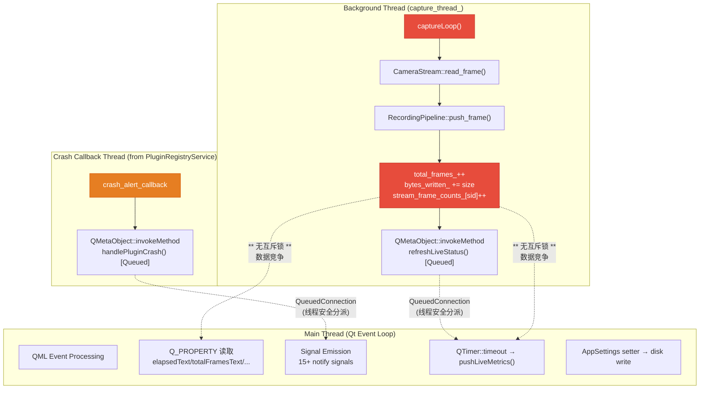

### 8.2 Side Effect Catalog

| 类别 | 位置 | 描述 |
|------|------|------|
| **线程创建** | `startRecording()` :332 | `std::thread([this] { captureLoop(); })` |
| **线程销毁** | `stopCaptureLoop()` :695-697 | `capture_running_ = false; capture_thread_.join()` |
| **跨线程调用** | `captureLoop()` :687 | `QMetaObject::invokeMethod(this, ..., Qt::QueuedConnection)` — 安全 |
| **跨线程调用** | `setupCrashAlertHandler()` :735 | crash callback 内 `QMetaObject::invokeMethod` — 安全 |
| **文件I/O (读)** | `getPluginDetail()` :549 | `std::ifstream(manifest_path)` 读取 plugin.json |
| **文件I/O (读)** | `AppSettings()` 构造 | `config_.load("micecam_config.json")` |
| **文件I/O (写)** | `AppSettings` 所有 setter | `config_.save("micecam_config.json")` — 每次 setter 立即写盘 |
| **文件I/O (写)** | `RecordingPipeline` | `pipeline_.start(config)` 创建输出文件 |
| **无锁原子写入** | `captureLoop()` :681 | `total_frames_++` — 非atomic，主线程同时读取 |
| **无锁原子写入** | `captureLoop()` :682 | `bytes_written_ += bytes.size()` — 非atomic，主线程同时读取 |
| **无锁原子写入** | `captureLoop()` :683-684 | `stream_frame_counts_[sid]++` — 主线程 pushLiveMetrics 读+清零 |
| **状态突变** | `refreshCameras()` | 重置 cameraModel + sourceModel + preflight_message |
| **状态突变** | `stopRecording()` :374 | `recording_ = false; session_start_ = {}` |
| **状态突变** | `handleDeviceDisconnect()` :805 | `active.stream.reset()` — 在 recording 期间清除流 |
| **平台调用** | `refreshCameras()` :174 | `micecam_request_camera_access()` — macOS AVFoundation 权限请求 |
| **内存分配** | `captureLoop()` :663 | `std::vector<uint8_t> bytes` — 每帧循环分配 |
| **QML信号风暴** | `refreshLiveStatus()` | 每33ms emit 4个信号 (1000字节日志条目) |

---

## S9 — Risks

### 9.1 Critical: Data Races on Shared Counters

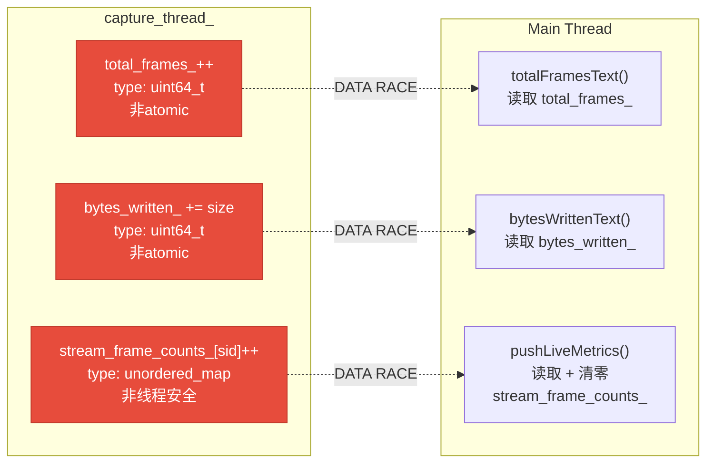

**影响**: total_frames_ 和 bytes_written_ 是 `uint64_t` 非原子类型。capture线程每33ms写入一次，主线程通过 Q_PROPERTY getter 和 pushLiveMetrics 频繁读取。在 x86_64/ARM64 上 uint64_t 写入可能tearing（特别是ARM上非对齐的64位写入）。stream_frame_counts_ 是 unordered_map，capture线程 insert++ 和主线程 read+clear 构成更严重的竞态（iterator invalidation, heap corruption）。

**建议**: (1) 将 total_frames_ 和 bytes_written_ 改为 `std::atomic<uint64_t>` (memory_order_relaxed 足够); (2) stream_frame_counts_ 加 std::mutex 或改为 per-stream atomic counters。

### 9.2 High: refreshLiveStatus 信号风暴

**描述**: captureLoop 每33ms (≈30fps) 调用 `QMetaObject::invokeMethod → refreshLiveStatus()`。每次调用：
- pushLogEntry 追加一条 `[DEBUG] Frames: N, Elapsed: MM:SS` 日志（上限50条，超限 removeFirst）
- emit 4个信号 (elapsedTextChanged, totalFramesTextChanged, bytesWrittenTextChanged, logEntriesChanged)

**影响**: 每秒约30次 QML 属性更新 + 日志列表变动 = 大量 QML binding re-evaluation。日志条目会迅速填满50条上限并频繁触发 QStringList 内存重分配。

**建议**: 降低 refreshLiveStatus 调用频率（例如每200ms一次），或将 DEBUG 日志写入文件而非内存列表。

### 9.3 High: active_streams_ 跨线程读写

**描述**: `active_streams_` 在主线程创建 (`startRecording()`) 和销毁 (`stopCaptureLoop()`)，但 captureLoop 在后台线程中遍历读取。stopRecording 调用 stopCaptureLoop 时，先设 capture_running_=false，再 join 线程，最后 clear active_streams_。join 保证了时序，但 handleDeviceDisconnect 中 `active.stream.reset()` 发生在 recording_ 期间，captureLoop 可能同时遍历该 stream。

**影响**: handleDeviceDisconnect 中 stream.reset() 可能与 captureLoop 中 `active.stream->is_open()` / `active.stream->read_frame()` 产生竞态。

**建议**: 给 active_streams_ 加读写锁（shared_mutex），或在 captureLoop 中先拷贝 shared_ptr 再访问。

### 9.4 Medium: AppSettings 同步写盘

**描述**: 每个属性的 setter 立即调用 `config_.save("micecam_config.json")` 写入磁盘。如果 QML Settings 页面在初始化时批量设置多个属性，会产生多次磁盘 I/O。

**影响**: 性能浪费；极端情况下快速连续写入可能损坏文件。

**建议**: 采用 debounce 模式，setter 中只标记 dirty，QTimer 延迟 500ms 后统一 save。

### 9.5 Medium: Plugin Crash During Recording

**描述**: handlePluginCrash 在录制期间 finalize 流并尝试 restart。如果所有插件同时崩溃，active_streams_ 中所有 stream 被清除，但 captureLoop 仍在运行（只是跳过所有 closed stream）。

**影响**: captureLoop 空转，不产生帧但持续消耗 CPU。recording_ 状态仍为 true。

**建议**: 在 handlePluginCrash 后检查 active_streams_ 是否还有有效 stream，若无则自动 stopRecording。

### 9.6 Low: capture_thread_ Lifetime

**描述**: AppController 析构函数未显式 stop capture_thread_。如果用户在录制期间关闭窗口，QGuiApplication 退出但 AppController 可能在 capture_thread_ 仍在运行时被销毁。

**影响**: std::thread 析构时如果 joinable 会调用 std::terminate。

**建议**: 在 AppController 析构函数中调用 stopCaptureLoop()。

### 9.7 Low: 每帧内存分配

**描述**: captureLoop 每次迭代为每个 stream 分配 `std::vector<uint8_t> bytes`。

**影响**: 33ms 周期内 N 个 stream × 30fps = N×30 次 heap allocation/秒。

**建议**: 预分配 per-stream buffer，复用内存。

---

## S10 — Requirements Mapping

| 需求编号 | 需求描述 | 实现位置 | 覆盖状态 |
|----------|----------|----------|----------|
| REQ-UI-001 | 相机设备发现与网格展示 | `refreshCameras()` → `AppCameraModel` → `CameraGridView.qml` | ✅ 完整 |
| REQ-UI-002 | 一键开始/停止录制 | `startRecording()` / `stopRecording()` → QML recordButtonText 绑定 | ✅ 完整 |
| REQ-UI-003 | 实时录制指标显示 (帧数/码率/耗时/写入量) | `pushLiveMetrics()` + `refreshLiveStatus()` → Q_PROPERTY 绑定 | ✅ 完整 (但有竞态) |
| REQ-UI-004 | 预检 (preflight) 检查 | `preflightItems()` → `PreflightModal.qml` | ✅ 完整 |
| REQ-UI-005 | 插件管理 (导入/启用/禁用/删除) | `importPlugin()` / `togglePlugin()` / `removePlugin()` → `PluginManagementPage.qml` | ✅ 完整 |
| REQ-UI-006 | 插件详情查看 | `getPluginDetail()` → `PluginDetailPage.qml` | ✅ 完整 |
| REQ-UI-007 | 告警通知推送 | `AppAlertModel::pushAlert()` → `NotificationPopup.qml` | ✅ 完整 |
| REQ-UI-008 | 插件崩溃自动恢复 | `handlePluginCrash()` → finalize + restart + reconnect | ✅ 完整 |
| REQ-UI-009 | 设备断开检测与处理 | `handleDeviceDisconnect()` → finalize stream + push alert | ✅ 完整 |
| REQ-UI-010 | 应用配置持久化 | `AppSettings` 18 属性 → `micecam_config.json` | ✅ 完整 |
| REQ-UI-011 | 相机源展示与设备指标 | `CameraSourceModel` → `PluginManagementPage.qml` | ✅ 完整 |
| REQ-UI-012 | macOS 相机权限请求 | `CameraPermissionHelper_mac.mm` → `micecam_request_camera_access()` | ✅ 完整 |
| REQ-UI-013 | 日志条目展示 | `recentLogEntries()` Q_PROPERTY → QML log panel | ✅ 完整 |
| REQ-UI-014 | 版本/构建信息显示 | `appVersion()` + `buildDate()` → `AboutView.qml` | ✅ 完整 |
| REQ-UI-015 | 多源插件系统 | `PluginRegistryService` + `CameraSourceModel` 按优先级排序 | ✅ 完整 |

---

## S11 — Coverage

### 11.1 Test Coverage Matrix

| 文件 | 单元测试 | 集成测试 | QML测试 | 覆盖评估 |
|------|----------|----------|---------|----------|
| `main.cpp` | — | — | — | ⚠️ 无测试 (入口点，通常不测) |
| `AppController.cpp` | — | — | — | ❌ **零覆盖** — 核心控制器无测试 |
| `AppSettings.cpp` | — | — | — | ❌ **零覆盖** |
| `AppCameraModel.cpp` | — | — | — | ❌ **零覆盖** |
| `AppAlertModel.cpp` | — | — | — | ❌ **零覆盖** |
| `CameraSourceModel.cpp` | — | — | — | ❌ **零覆盖** |
| `MockCameraModel.cpp` | ✅ 存在 | — | — | 仅作为测试替身 |
| `CameraPermissionHelper` | — | — | — | ⚠️ 无测试 |

### 11.2 关键未测试路径

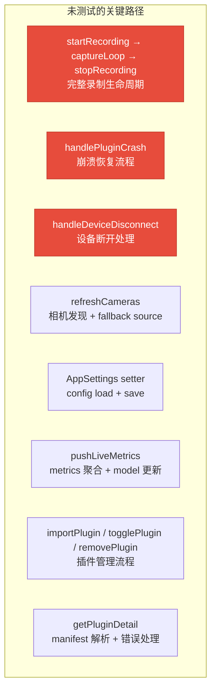

### 11.3 建议测试优先级

| 优先级 | 测试目标 | 理由 |
|--------|----------|------|
| P0 | `startRecording` → `captureLoop` → `stopRecording` 生命周期 | 核心业务路径，涉及多线程 |
| P0 | 数据竞态测试 (total_frames_, stream_frame_counts_) | 已确认的竞态条件 |
| P1 | `handlePluginCrash` + `handleDeviceDisconnect` | 异常恢复路径，直接影响数据完整性 |
| P1 | `refreshCameras` fallback source 逻辑 | 复杂的条件分支，容易出bug |
| P2 | `AppCameraModel` / `AppAlertModel` / `CameraSourceModel` CRUD | 数据模型基础正确性 |
| P2 | `AppSettings` round-trip (set → save → load → get) | 配置持久化完整性 |
| P3 | `getPluginDetail` manifest 解析错误路径 | 防御性编程验证 |
| P3 | `MockCameraModel` simulate 系列方法 | 确保测试替身行为正确 |

---

## S12 — Pseudocode

### 12.1 startRecording()

```
FUNCTION startRecording() -> bool
    GUARD: recording_ == true         => return false
    GUARD: camera_model_.rowCount==0  => set preflight "No cameras", emit, return false

    session_id_ = "session_" + system_clock::now().time_since_epoch().count()

    config = SessionConfig
    config.session_id = session_id_
    config.output_dir = output_dir_ OR "."

    FOR EACH (device IN discover_all()) STREAM (stream IN device.streams):
        sc = StreamConfig(device.id, stream.index,
                          stream.max_width, stream.max_height,
                          first(supported_framerates) OR 30,
                          first(supported_formats) OR "rgb24")
        config.streams.push(sc)

    IF NOT pipeline_.start(config):
        return false

    current_encoder_name_ = "H.264"
    current_bitrate_ = "5.0 Mbps"
    emit encoderNameChanged, bitrateChanged

    log("[INFO] Session started: " + session_id_)

    active_streams_.clear()
    FOR EACH stream_config IN config.streams:
        stream = manager_.open_stream(stream_config)
        IF stream != null:
            active_streams_.push({stream_config, move(stream)})

    capture_running_ = true
    capture_thread_ = Thread(captureLoop)

    session_start_ = steady_clock::now()
    recording_ = true
    stream_frame_counts_.clear()
    stream_drop_counts_.clear()
    last_metrics_push_ = now
    metrics_timer_.start(1000ms)

    EMIT isRecordingChanged, canStartRecordingChanged,
         recordButtonTextChanged, lastSessionIdChanged
    return true
```

### 12.2 captureLoop()

```
FUNCTION captureLoop() -> void    // runs on capture_thread_
    WHILE capture_running_ == true:
        FOR EACH active IN active_streams_:
            IF active.stream == null OR NOT active.stream.is_open():
                CONTINUE

            (bytes, pts) = active.stream.read_frame()
            IF read failed:
                CONTINUE

            stream_id = active.config.device_id + "_" + active.config.stream_index

            frame = FrameData(
                stream_id=stream_id,
                data=bytes.data, size=bytes.size,
                width=active.stream.width(), height=active.stream.height(),
                pts=pts,
                source_format=active.stream.pixel_format()
            )

            IF pipeline_.push_frame(frame):
                total_frames_++                      // ⚠ RACE: non-atomic
                bytes_written_ += bytes.size()        // ⚠ RACE: non-atomic
                stream_frame_counts_[stream_id]++     // ⚠ RACE: non-atomic map
                stream_drop_counts_[stream_id] += frame.dropped_frame_count

        // ⚠ 每33ms向主线程分派 refreshLiveStatus
        QMetaObject::invokeMethod(this, refreshLiveStatus, QueuedConnection)
        sleep(33ms)
```

### 12.3 handlePluginCrash()

```
FUNCTION handlePluginCrash(pluginId) -> void    // runs on main thread (via QueuedConnection)
    pluginName = toQString(pluginId)
    log("[WARN] Plugin crashed: " + pluginName)

    alert_model_.pushAlert(
        title="Plugin crash detected — recovering...",
        source=pluginName, severity=1,
        alertId="crash_" + pluginName, autoDismiss=true)

    emit pluginCrashAlert(pluginName)

    streams = plugin_registry_.get_streams_for_plugin(pluginId)
    FOR EACH stream_id IN streams:
        pipeline_.finalize_stream(stream_id)

    result = plugin_registry_.handle_plugin_crash(pluginId)

    IF result.restart_succeeded:
        alert_model_.dismissBySource(pluginName)
        log("[INFO] Plugin " + pluginName + " restarted")
        reconnect_idx = 1
        FOR EACH stream_id IN result.finalized_streams:
            pipeline_.start_reconnect(stream_id, reconnect_idx)
    ELSE:
        alert_model_.dismissBySource(pluginName)
        alert_model_.pushAlert(
            title="Plugin recovery failed — " + pluginName,
            source=pluginName, severity=2,
            alertId="crash_" + pluginName, autoDismiss=false)
        log("[ERROR] Plugin " + pluginName + " recovery failed")
```

---

## S13 — Audit Conclusions

### 13.1 总体评估

| 维度 | 评分 (1-10) | 说明 |
|------|-------------|------|
| **架构清晰度** | **8/10** | AppController 作为中央控制器，职责边界明确。Model 层分离干净。QML ↔ C++ 绑定模式标准。扣分：AppController 承担过多职责（录制管理+插件管理+设备管理+日志+metrics），可考虑拆分 |
| **线程安全性** | **4/10** | 仅 capture_running_ 使用 atomic。total_frames_, bytes_written_, stream_frame_counts_, active_streams_ 存在确认的数据竞态。QMetaObject::invokeMethod 使用正确 |
| **测试覆盖率** | **1/10** | 除 MockCameraModel 外零测试覆盖。核心录制流程、崩溃恢复、设备断开全部未测试 |
| **错误处理** | **7/10** | plugin.json 解析有 try-catch。pipeline start 失败有 guard。handlePluginCrash 有成功/失败分支。扣分：captureLoop 中 read_frame/push_frame 失败静默跳过，无错误计数 |
| **性能** | **5/10** | refreshLiveStatus 33ms 频率过高。每帧堆分配。AppSettings 单次 setter 即写盘。stream_frame_counts_ 无预分配 |
| **可维护性** | **7/10** | 代码结构清晰，命名规范。MockCameraModel 存在说明有测试意识。扣分：812行 AppController 单文件过长 |

### 13.2 必须修复 (Critical)

1. **数据竞态** — `total_frames_`, `bytes_written_`, `stream_frame_counts_`, `stream_drop_counts_` 加 atomic 或 mutex 保护
2. **active_streams_ 竞态** — handleDeviceDisconnect 中 stream.reset() 与 captureLoop 遍历需同步
3. **析构安全** — AppController 析构函数中调用 `stopCaptureLoop()`

### 13.3 建议改进 (Recommended)

4. **降低 refreshLiveStatus 频率** — 从 33ms 改为 200ms，或改为 pushLiveMetrics 驱动
5. **DEBUG 日志写入文件** — 不要存储在内存 QStringList 中
6. **AppSettings debounce** — setter 标记 dirty，延迟批量 save
7. **预分配帧 buffer** — 避免 captureLoop 中每帧 heap allocation
8. **空转检测** — handlePluginCrash 后检查是否还有有效 stream

### 13.4 测试建设路线

| 阶段 | 目标 | 预计工作量 |
|------|------|------------|
| Phase 1 | AppCameraModel / AppAlertModel / CameraSourceModel CRUD 单元测试 | 2-3天 |
| Phase 2 | AppController 多线程测试 (mock CameraManager + RecordingPipeline) | 3-5天 |
| Phase 3 | startRecording → captureLoop → stopRecording 集成测试 (真实 pipeline) | 3-5天 |
| Phase 4 | handlePluginCrash / handleDeviceDisconnect 异常路径测试 | 2-3天 |
| Phase 5 | AppSettings round-trip + QML 绑定验证 | 1-2天 |

### 13.5 架构建议

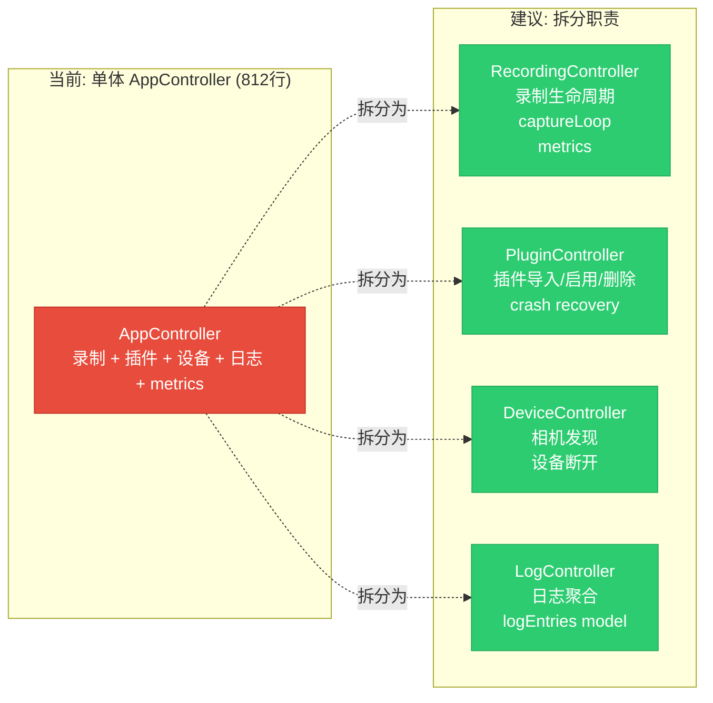

> **审计结论**: UI 层架构设计合理，QML/C++ 边界清晰，但**线程安全是最大隐患**。5个确认的数据竞态点中3个涉及后台帧采集循环，在持续录制场景下几乎必然触发。建议在进入 beta 阶段前完成所有 Critical 级修复，并建立 Phase 1-2 的测试基础设施。
