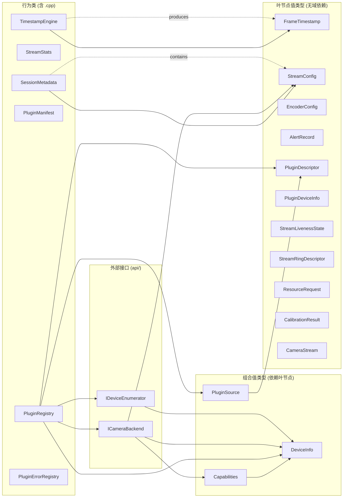
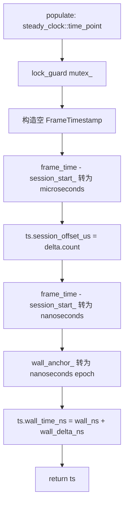
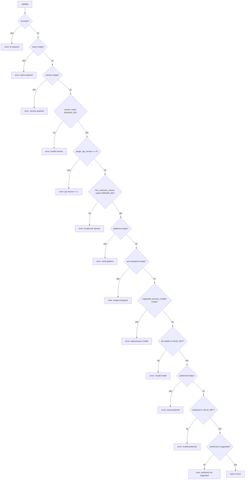
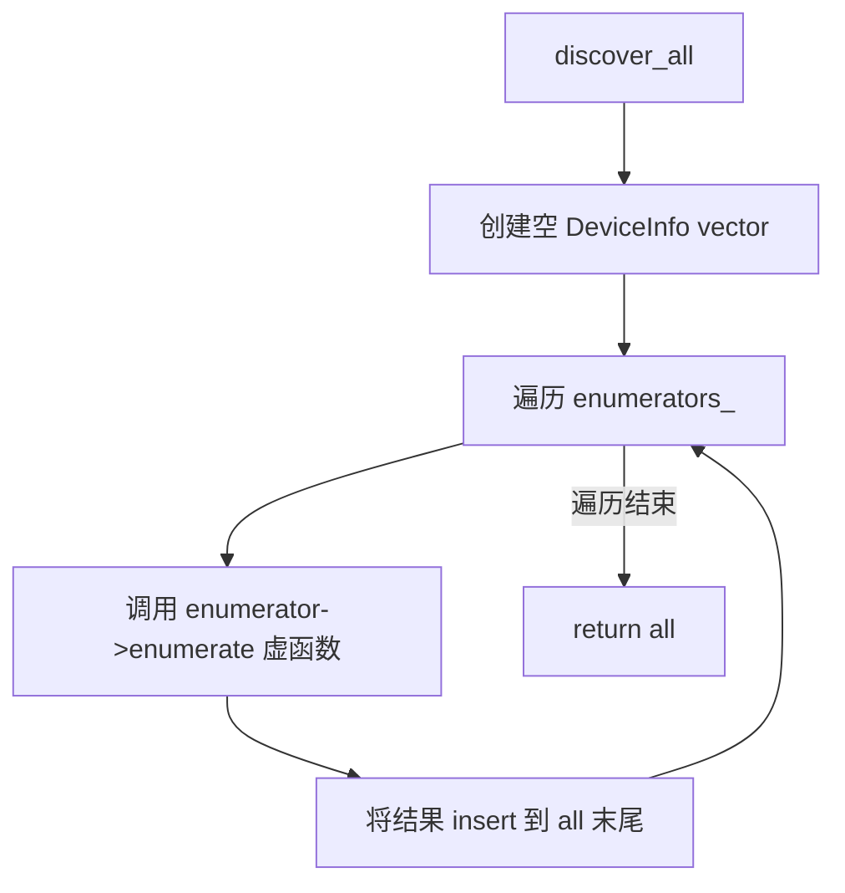
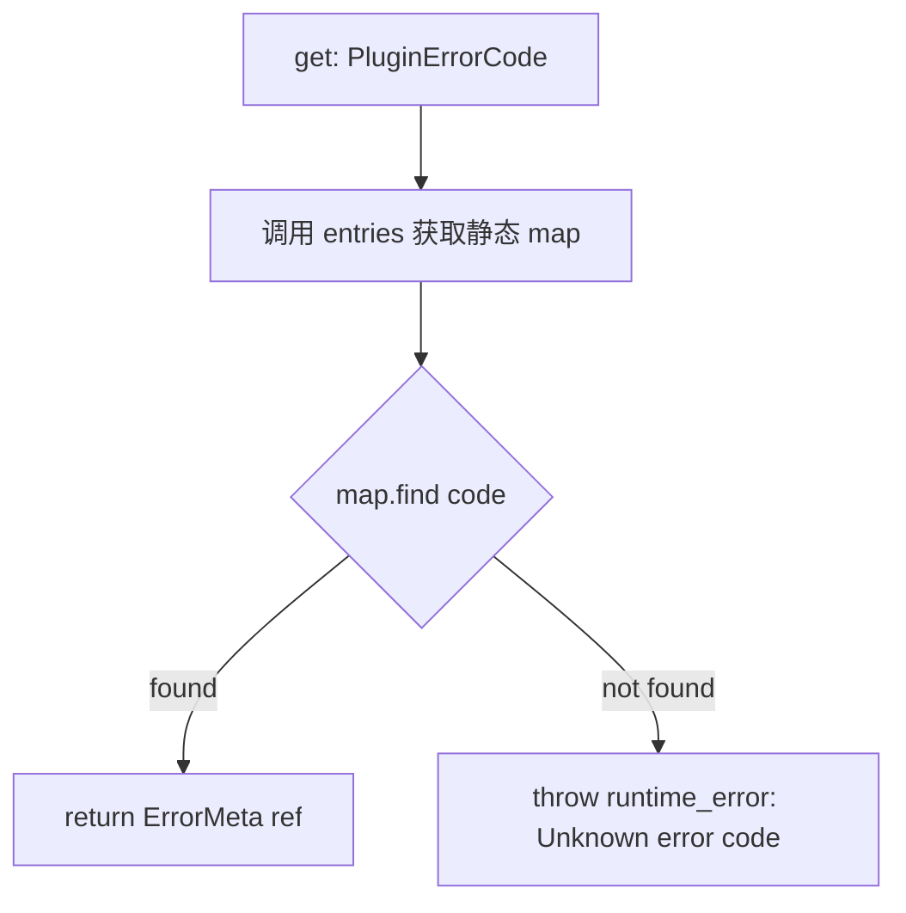
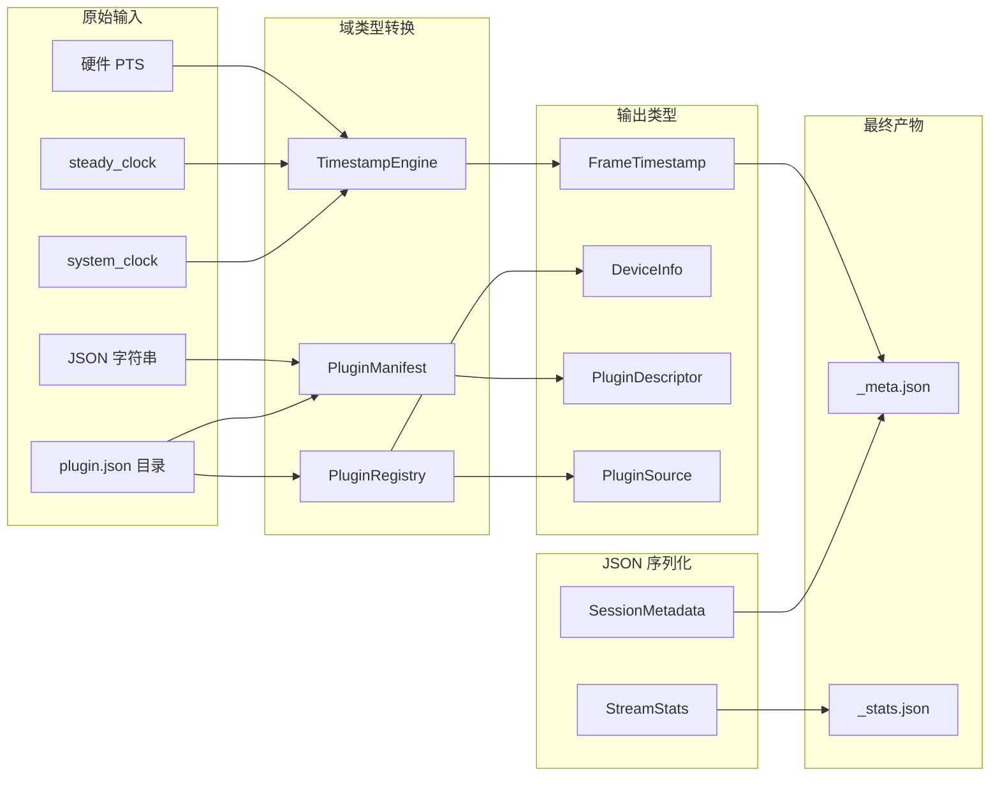
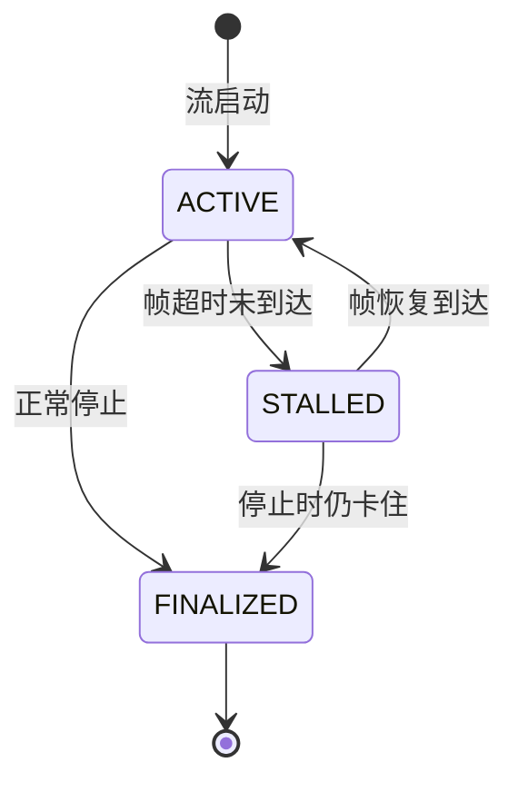
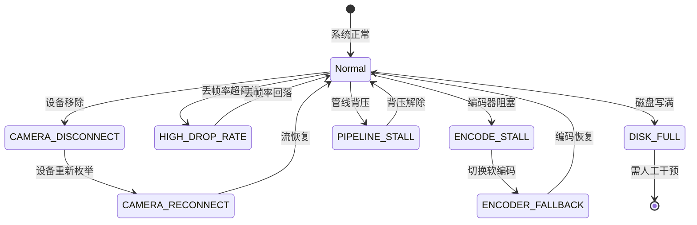
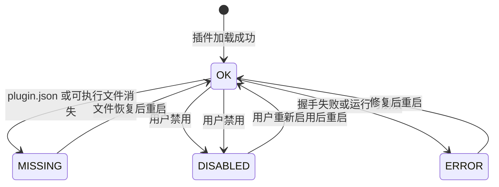

# MiceCam v2 — `internal/domain/` 语义审计地图

> **审计日期**: 2026-05-22
> **审计范围**: `internal/domain/` 全部 27 个文件 (21 .h + 6 .cpp)，985 行代码
> **审计工具**: 源码全读 + Mermaid 图生成 + 契约推理
> **审计员置信度**: HIGH — 所有 .h/.cpp 均已逐行阅读

---

## Section 0: 一屏摘要

| 源文件 | 类型 | 类/结构 | 核心职责 | 依赖数 | 被依赖数 | 公开API数 | 状态复杂度 | 副作用复杂度 | 最终风险 | 行数 | 置信度 |
|---|---|---|---|---|---|---|---|---|---|---|---|
| `FrameTimestamp.h` | struct | `FrameTimestamp` | 帧时间戳值对象 | 0 | 1 | 0 | NONE | NONE | NONE | 14 | HIGH |
| `StreamConfig.h` | struct | `StreamConfig` | 流配置参数 | 0 | 1 | 0 | NONE | NONE | NONE | 17 | HIGH |
| `DeviceInfo.h` | struct | `ResolutionOption`, `StreamInfo`, `DeviceInfo` | 设备描述层级 | 0 | 2 | 0 | NONE | NONE | NONE | 36 | HIGH |
| `CameraStream.h` | abstract | `CameraStream` | 流读取抽象接口 | 0 | 0 | 7 | NONE | NONE | NONE | 22 | HIGH |
| `EncoderConfig.h` | struct | `EncoderConfig` | 编码器配置 | 0 | 0 | 0 | NONE | NONE | NONE | 13 | HIGH |
| `AlertRecord.h` | enum+struct | `AlertSeverity`, `AlertType`, `AlertRecord` | 告警分类与记录 | 0 | 0 | 0 | NONE | NONE | NONE | 28 | HIGH |
| `Capabilities.h` | struct | `Capabilities` | 编码能力描述 | 1 | 0 | 0 | NONE | NONE | NONE | 17 | HIGH |
| `PluginDescriptor.h` | enum+struct | `PluginSourceType`, `PluginDescriptor` | 插件描述符 | 0 | 2 | 0 | NONE | NONE | NONE | 21 | HIGH |
| `PluginSource.h` | enum+struct | `PluginDiagnosticsState`, `PluginSource` | 插件源状态 | 1 | 1 | 0 | NONE | NONE | NONE | 26 | HIGH |
| `PluginDeviceInfo.h` | struct | `PluginDeviceInfo` | 插件级设备信息 | 0 | 0 | 0 | NONE | NONE | NONE | 27 | HIGH |
| `StreamLivenessState.h` | enum+struct | `StreamLivenessState`, `StreamStallEvent` | 流存活状态 | 0 | 0 | 0 | NONE | NONE | NONE | 21 | HIGH |
| `StreamRingDescriptor.h` | enum+struct | `PayloadKind`, `RingOwnership`, `RingPolicy`, `PayloadHeader`, `StreamRingDescriptor` | 共享内存环描述 | 0 | 0 | 2 | NONE | NONE | NONE | 50 | HIGH |
| `ResourceRequest.h` | enum+struct | `StreamSlot`, `ResourceRequest`, `StreamAllocationRequest`, `RingAllocation`, `AllocationDecision`, `GlobalResourceBudget`, `AllocationPolicy`, `ProcessModel` | 资源预算与分配决策 | 0 | 0 | 0 | NONE | NONE | NONE | 72 | HIGH |
| `CalibrationResult.h` | struct | `CalibrationResult` | 编码校准结果 | 0 | 0 | 0 | NONE | NONE | NONE | 23 | HIGH |
| `TimestampEngine.h/.cpp` | class | `TimestampEngine` | 帧时间戳生成引擎 | 1 | 0 | 4 | MUTABLE | LOCK+TIME | MEDIUM | 63 | HIGH |
| `StreamStats.h/.cpp` | struct | `StreamStats` | 流统计序列化 | 0 | 0 | 1 | IMMUTABLE | PURE | LOW | 55 | HIGH |
| `SessionMetadata.h/.cpp` | struct | `SessionMetadata` | 会话元数据双向序列化 | 1 | 0 | 2 | IMMUTABLE | PURE | LOW | 90 | HIGH |
| `PluginManifest.h/.cpp` | struct | `PlatformEntrypoint`, `PluginManifest` | 插件清单解析/校验 | 0 | 0 | 3 | IMMUTABLE | PURE | MEDIUM | 144 | HIGH |
| `PluginRegistry.h/.cpp` | class | `PluginRegistry` | 插件注册与设备发现聚合 | 3 | 0 | 9 | MUTABLE | HEAP+VIRTUAL | LOW-MEDIUM | 105 | HIGH |
| `PluginErrorRegistry.h/.cpp` | class | `PluginErrorRegistry` | 插件错误码静态目录 | 0 | 0 | 2 | STATIC | THROW | LOW | 141 | HIGH |

**总计**: 27 文件 | 985 行 | 30 个公开 API | 2 个可变状态类 | 0 个已知缺陷

---

## Section 1: 模块框架图



---

## Section 2: 核心执行流程图

### TimestampEngine::populate()



### PluginManifest::validate()



### PluginRegistry::discover_all()



### PluginErrorRegistry::get()



---

## Section 3: 数据流图



---

## Section 4: 状态机图

### StreamLivenessState



### AlertType 触发转换



### PluginDiagnosticsState



---

## Section 5: 函数调用图

```mermaid
flowchart TD
    subgraph TimestampEngine
        TE_CWA[capture_wall_anchor]
        TE_TSO[to_session_offset]
        TE_WHP[with_hardware_pts]
        TE_POP[populate]
    end

    subgraph StreamStats
        SS_TJ[to_json]
    end

    subgraph SessionMetadata
        SM_TJ[to_json]
        SM_FJ[from_json]
    end

    subgraph PluginManifest
        PM_FJ[from_json]
        PM_TJ[to_json]
        PM_V[validate]
    end

    subgraph PluginRegistry
        PR_RB[register_backend]
        PR_RE[register_enumerator]
        PR_RX[register_external]
        PR_HE[has_external]
        PR_GEP[get_external_plugins]
        PR_GSG[get_source_grouped_plugins]
        PR_GS[get_sources]
        PR_DA[discover_all]
        PR_GB[get_backend]
    end

    subgraph PluginErrorRegistry
        PER_E[entries]
        PER_G[get]
    end

    subgraph StreamRingDescriptor
        SRD_PH[PayloadHeader.header_size]
        SRD_SRD[StreamRingDescriptor.header_size]
    end

    TE_CWA -->|writes| TE_POP
    TE_CWA -->|writes| TE_TSO
    TE_POP -->|reads session_start_| TE_TSO
    PR_GSG --> PR_GEP
    PR_GS -->|reads external_plugins_| PR_RX
    PR_DA -->|calls| ENUM[enumerator.enumerate]
    PR_GB -->|calls| BN[backend.backend_name]
    PER_G --> PER_E
    SRD_SRD --> SRD_PH
```



---

## Section 6: 状态变量表

### TimestampEngine (唯三可变状态)

| 变量 | 类型 | 初始值 | 写入者 | 读取者 | 线程安全 | 风险 |
|---|---|---|---|---|---|---|
| `mutex_` | `std::mutex` | 默认构造 | 全部 4 个方法 | 全部 4 个方法 | YES (lock_guard) | 低 |
| `wall_anchor_` | `system_clock::time_point` | 默认 (epoch) | `capture_wall_anchor()` | `populate()` | YES (mutex) | **中** — 未调用 capture_wall_anchor 前为 epoch |
| `session_start_` | `steady_clock::time_point` | 默认 | `capture_wall_anchor()` | `to_session_offset()`, `populate()` | YES (mutex) | **中** — 未初始化时 delta 无意义 |

### PluginRegistry (容器状态, 非域核心关注)

| 变量 | 类型 | 写入者 | 读取者 | 线程安全 |
|---|---|---|---|---|
| `backends_` | `vector<unique_ptr<ICameraBackend>>` | `register_backend()` | `get_backend()` | NO — 调用方需保证注册完成后只读 |
| `enumerators_` | `vector<unique_ptr<IDeviceEnumerator>>` | `register_enumerator()` | `discover_all()` | NO — 同上 |
| `external_plugins_` | `vector<PluginDescriptor>` | `register_external()` | `has_external()`, `get_external_plugins()`, `get_sources()` | NO — 同上 |

---

## Section 7: 函数契约总表

### TimestampEngine

| 函数 | 签名 | 前置条件 | 后置条件 | 代码证据 |
|---|---|---|---|---|
| `capture_wall_anchor` | `void capture_wall_anchor()` | 无 | `wall_anchor_` = 当前 system_clock; `session_start_` = 当前 steady_clock | `TimestampEngine.cpp:5-9` |
| `to_session_offset` | `uint64_t to_session_offset(steady_clock::time_point)` | `capture_wall_anchor()` 已调用 | 返回 `frame_time - session_start_` 的微秒数 | `TimestampEngine.cpp:11-15` |
| `with_hardware_pts` | `FrameTimestamp with_hardware_pts(uint64_t)` | 无严格前置 | 返回 `has_hardware_pts=true, hardware_pts=hw_pts, session_offset_us=0` | `TimestampEngine.cpp:17-24` |
| `populate` | `FrameTimestamp populate(steady_clock::time_point)` | `capture_wall_anchor()` 已调用 | `session_offset_us` 为微秒偏移, `wall_time_ns` = wall_anchor epoch + 纳秒偏移 | `TimestampEngine.cpp:26-38` |

### StreamStats

| 函数 | 签名 | 前置条件 | 后置条件 | 代码证据 |
|---|---|---|---|---|
| `to_json` | `nlohmann::json to_json() const` | 无 | 返回包含全部 12 个字段的 JSON 对象; `transport` 仅在非 null 时包含 | `StreamStats.cpp:7-25` |

### SessionMetadata

| 函数 | 签名 | 前置条件 | 后置条件 | 代码证据 |
|---|---|---|---|---|
| `to_json` | `nlohmann::json to_json() const` | 无 | 返回完整会话元数据 JSON; `stream_configs` 展开为数组; `plugin_source` 仅非 null 时包含 | `SessionMetadata.cpp:5-31` |
| `from_json` | `static SessionMetadata from_json(const json&)` | JSON 包含预期字段或使用默认值 | 返回反序列化的 SessionMetadata; `stream_configs` 从数组恢复 | `SessionMetadata.cpp:33-59` |

### PluginManifest

| 函数 | 签名 | 前置条件 | 后置条件 | 代码证据 |
|---|---|---|---|---|
| `from_json` | `static PluginManifest from_json(const json&)` | JSON 对象非空 | 返回反序列化的 PluginManifest; 缺失字段使用默认值 | `PluginManifest.cpp:8-39` |
| `to_json` | `nlohmann::json to_json() const` | 无 | 返回完整插件清单 JSON; `platforms` 展开为嵌套对象 | `PluginManifest.cpp:41-65` |
| `validate` | `vector<string> validate() const` | 无 | 返回校验错误列表; 空列表表示通过; 检查 8 项必填 + semver + process model 一致性 | `PluginManifest.cpp:71-106` |

### PluginRegistry

| 函数 | 签名 | 前置条件 | 后置条件 | 代码证据 |
|---|---|---|---|---|
| `register_backend` | `void register_backend(unique_ptr<ICameraBackend>)` | backend 非 nullptr | `backends_` 尾部追加; 所有权转移 | `PluginRegistry.cpp:5-7` |
| `register_enumerator` | `void register_enumerator(unique_ptr<IDeviceEnumerator>)` | enumerator 非 nullptr | `enumerators_` 尾部追加; 所有权转移 | `PluginRegistry.cpp:9-11` |
| `register_external` | `void register_external(PluginDescriptor)` | 无 | `external_plugins_` 尾部追加 | `PluginRegistry.cpp:13-15` |
| `has_external` | `bool has_external() const` | 无 | 返回 `!external_plugins_.empty()` | `PluginRegistry.cpp:17-19` |
| `get_external_plugins` | `vector<PluginDescriptor*> get_external_plugins()` | 无 | 返回指向 `external_plugins_` 内部元素的裸指针数组 | `PluginRegistry.cpp:21-28` |
| `get_source_grouped_plugins` | `vector<PluginDescriptor*> get_source_grouped_plugins()` | 无 | 委托给 `get_external_plugins()` | `PluginRegistry.cpp:30-32` |
| `get_sources` | `vector<PluginSource> get_sources() const` | 无 | 将 `external_plugins_` 映射为 `PluginSource` 数组; diagnostics 默认 OK | `PluginRegistry.cpp:34-49` |
| `discover_all` | `vector<DeviceInfo> discover_all()` | 至少注册一个 enumerator | 聚合所有 enumerator 的设备列表 | `PluginRegistry.cpp:51-58` |
| `get_backend` | `ICameraBackend* get_backend(const string&)` | 无 | 返回匹配 `backend_name()` 的裸指针, 未找到返回 nullptr | `PluginRegistry.cpp:60-67` |

### PluginErrorRegistry

| 函数 | 签名 | 前置条件 | 后置条件 | 代码证据 |
|---|---|---|---|---|
| `entries` | `static const unordered_map<PluginErrorCode, ErrorMeta>& entries()` | 无 | 返回包含 17 个错误码的静态常量 map 引用 | `PluginErrorRegistry.cpp:7-78` |
| `get` | `static const ErrorMeta& get(PluginErrorCode)` | code 在 map 中存在 | 返回对应 ErrorMeta 引用; 不存在则 throw `runtime_error` | `PluginErrorRegistry.cpp:80-87` |

### StreamRingDescriptor

| 函数 | 签名 | 前置条件 | 后置条件 | 代码证据 |
|---|---|---|---|---|
| `PayloadHeader::header_size` | `static constexpr uint64_t header_size()` | 编译期 | 返回 44 字节 | `StreamRingDescriptor.h:24-27` |
| `StreamRingDescriptor::header_size` | `static constexpr uint64_t header_size()` | 编译期 | 委托给 `PayloadHeader::header_size()`, 返回 44 | `StreamRingDescriptor.h:45-47` |

### CameraStream (抽象接口)

| 函数 | 签名 | 前置条件 | 后置条件 | 代码证据 |
|---|---|---|---|---|
| `read_frame` | `virtual bool read_frame(vector<uint8_t>&, int64_t&) = 0` | 流已打开 | 成功返回 true 并填充 data+pts; 失败返回 false | `CameraStream.h:13` |
| `width` | `virtual int width() const = 0` | 流已打开 | 返回帧宽度 | `CameraStream.h:14` |
| `height` | `virtual int height() const = 0` | 流已打开 | 返回帧高度 | `CameraStream.h:15` |
| `fps` | `virtual int fps() const = 0` | 流已打开 | 返回帧率 | `CameraStream.h:16` |
| `pixel_format` | `virtual string pixel_format() const = 0` | 流已打开 | 返回像素格式字符串 | `CameraStream.h:17` |
| `is_open` | `virtual bool is_open() const = 0` | 无 | 返回流是否处于打开状态 | `CameraStream.h:18` |
| `close` | `virtual void close() = 0` | 无 | 释放流资源; 调用后 `is_open()` 返回 false | `CameraStream.h:19` |

---

## Section 8: 函数副作用矩阵

| 函数 | 读状态 | 写状态 | 堆分配 | IO | 锁 | 虚派发 | 异常 | 纯净度 |
|---|---|---|---|---|---|---|---|---|
| `TimestampEngine::capture_wall_anchor` | - | mutex_, wall_anchor_, session_start_ | - | - | YES | - | - | IMPURE |
| `TimestampEngine::to_session_offset` | mutex_, session_start_ | - | - | - | YES | - | - | IMPURE |
| `TimestampEngine::with_hardware_pts` | mutex_ | - | FrameTimestamp 栈上 | - | YES | - | - | IMPURE |
| `TimestampEngine::populate` | mutex_, wall_anchor_, session_start_ | - | FrameTimestamp 栈上 | - | YES | - | - | IMPURE |
| `StreamStats::to_json` | this 字段 | - | nlohmann::json 堆 | - | - | - | - | PURE |
| `SessionMetadata::to_json` | this 字段 | - | nlohmann::json 堆 | - | - | - | - | PURE |
| `SessionMetadata::from_json` | j 参数 | - | SessionMetadata + json 堆 | - | - | - | 可能 (json parse) | PURE* |
| `PluginManifest::from_json` | j 参数 | - | PluginManifest + json 堆 | - | - | - | 可能 (json parse) | PURE* |
| `PluginManifest::to_json` | this 字段 | - | nlohmann::json 堆 | - | - | - | - | PURE |
| `PluginManifest::validate` | this 字段 | - | vector<string> 堆 | - | - | - | - | PURE |
| `PluginRegistry::register_backend` | - | backends_ | unique_ptr move | - | - | - | - | IMPURE |
| `PluginRegistry::register_enumerator` | - | enumerators_ | unique_ptr move | - | - | - | - | IMPURE |
| `PluginRegistry::register_external` | - | external_plugins_ | PluginDescriptor move | - | - | - | - | IMPURE |
| `PluginRegistry::has_external` | external_plugins_ | - | - | - | - | - | - | PURE |
| `PluginRegistry::get_external_plugins` | external_plugins_ | - | vector<PluginDescriptor*> 堆 | - | - | - | - | PURE |
| `PluginRegistry::get_source_grouped_plugins` | external_plugins_ | - | vector 堆 | - | - | - | - | PURE |
| `PluginRegistry::get_sources` | external_plugins_ | - | vector<PluginSource> 堆 | - | - | - | - | PURE |
| `PluginRegistry::discover_all` | enumerators_ | - | vector<DeviceInfo> 堆 | - | - | YES | 可能 (虚函数) | IMPURE |
| `PluginRegistry::get_backend` | backends_ | - | - | - | - | YES | - | IMPURE |
| `PluginErrorRegistry::entries` | - | - | 静态 map (首次分配) | - | - | - | - | PURE* |
| `PluginErrorRegistry::get` | 静态 map | - | - | - | - | - | YES (runtime_error) | IMPURE |
| `PayloadHeader::header_size` | - | - | - | - | - | - | - | CONSTEXPR |
| `StreamRingDescriptor::header_size` | - | - | - | - | - | - | - | CONSTEXPR |

> PURE* = 不修改任何状态但可能因外部库 (nlohmann/json) 抛异常

---

## Section 9: 边界条件与风险矩阵

### R1: TimestampEngine — 未初始化状态

| 风险 | 严重度 | 概率 | 影响 | 缓解现状 | 建议 |
|---|---|---|---|---|---|
| `populate()` 在 `capture_wall_anchor()` 之前调用 | MEDIUM | LOW | `session_start_` 为 epoch, `session_offset_us` 为天文数字 | 无检查 | 添加 `bool anchored_` 标志, 未锚定时返回零时间戳或抛异常 |
| `steady_clock` 与 `system_clock` 跨度溢出 | LOW | VERY LOW | 纳秒 `uint64_t` 可表示 ~584 年 | 足够 | 无需操作 |
| 多线程高频调用 `populate()` 导致 mutex 争用 | MEDIUM | MEDIUM | 帧延迟增加 | mutex 保护 | 考虑 `std::atomic` 存储锚点快照, 避免每帧加锁 |

### R2: PluginManifest — 校验正确性

| 风险 | 严重度 | 概率 | 影响 | 缓解现状 | 建议 |
|---|---|---|---|---|---|
| semver 正则 `SEMVER_RE` 不覆盖所有有效 semver | LOW | LOW | 合法版本号被拒绝 | 正则包含预发布和构建元数据 | 已足够, 可补充测试用例 |
| `from_json` 不抛异常, 静默使用默认值 | MEDIUM | MEDIUM | 损坏的 JSON 产生空壳对象 | `j.value()` 提供默认值 | 调用方应先调用 `validate()` |
| `validate()` 不检查 `id` 格式 (如路径遍历) | MEDIUM | LOW | 恶意 plugin id 可注入路径 | 当前无检查 | FR-3 要求拒绝路径遍历, 需补充 id 格式校验 |

### R3: PluginRegistry — 生命周期安全

| 风险 | 严重度 | 概率 | 影响 | 缓解现状 | 建议 |
|---|---|---|---|---|---|
| `get_external_plugins()` 返回裸指针, 悬空风险 | HIGH | LOW | vector realloc 后指针失效 | `register_external` 只在尾部追加 | 改为返回 `span` 或 index; 或文档声明只能在注册阶段后调用 |
| `get_backend()` 返回 nullptr, 调用方未检查 | MEDIUM | MEDIUM | 空指针解引用 | 无检查 | 改为返回 `optional<ref>` 或使用 Expected 模式 |
| `discover_all()` 虚函数调用可能抛异常 | LOW | MEDIUM | 部分设备丢失 | 异常传播到调用方 | 考虑 try-catch 包裹每个 enumerator |

### R4: PluginErrorRegistry — 完备性

| 风险 | 严重度 | 概率 | 影响 | 缓解现状 | 建议 |
|---|---|---|---|---|---|
| `get()` 对未知 code 抛 `runtime_error` | LOW | VERY LOW | 未捕获异常导致崩溃 | FR-12 要求结构化错误 | 改为返回默认 ErrorMeta 而非抛异常 |
| 错误码列表不完整 | LOW | LOW | 新增错误类型无对应 meta | 17 个码覆盖主要场景 | 建立编译期或测试期枚举全覆盖检查 |

### R5: JSON 序列化 — 数据完整性

| 风险 | 严重度 | 概率 | 影响 | 缓解现状 | 建议 |
|---|---|---|---|---|---|
| `SessionMetadata::from_json` 缺少 `keyframe_interval` 反序列化 | LOW | N/A | 已有: `j.value("keyframe_interval", 0)` | 正确 | - |
| `to_json`/`from_json` 往返不对称 | MEDIUM | LOW | 数据丢失 | `to_json` 省略空字段; `from_json` 用默认值填充 | 对于必需字段不应省略 |

---

## Section 10: 需求符合性矩阵

> FR 编号来自 `docs/requirements/plugin-camera-backend-system.md`

| 需求 | 涉及域类型 | 实现状态 | 代码证据 | 缺口 |
|---|---|---|---|---|
| **FR-1** 插件注册与发现 | `PluginRegistry`, `PluginDescriptor`, `PluginSource` | **已实现** | `PluginRegistry::discover_all()` 聚合设备; `get_sources()` 产出 PluginSource 含 source_id/name/type/path/version/diagnostics | 缺少 bundled vs linked 目录扫描逻辑 (不在 domain 层) |
| **FR-2** 插件清单 | `PluginManifest` | **已实现** | `PluginManifest::from_json()` 解析全部字段; `to_json()` 序列化; `validate()` 校验 8 项 | 完整 |
| **FR-3** 导入验证 | `PluginManifest` | **部分实现** | `validate()` 检查 id/name/version/platforms/process_models | 缺少路径遍历检测、可执行文件存在性检查 (需 infra 层) |
| **FR-4** 进程模型 | `ResourceRequest::ProcessModel`, `PluginManifest` | **已实现** | `ProcessModel` 枚举: SINGLETON/PER_DEVICE/PER_STREAM; `PluginManifest` 含 supported/preferred_process_model | 完整 |
| **FR-5** gRPC 控制契约 | (不在此层) | **超出范围** | domain 层不涉及 gRPC | N/A |
| **FR-6** 共享内存帧传输 | `StreamRingDescriptor`, `PayloadHeader` | **已实现** | `StreamRingDescriptor` 含 slot_count/slot_size/handle/ownership/policy/sequence; `PayloadHeader` 含 pts/sequence/keyframe/checksum | 完整; release/ack 协议需 infra 层实现 |
| **FR-7** 输出规范化 | `StreamStats`, `SessionMetadata`, `FrameTimestamp` | **已实现** | `SessionMetadata` 快照会话参数; `StreamStats` 记录帧统计; `FrameTimestamp` 提供时间基准 | 完整 |
| **FR-8** 配置 Schema | (不在此层) | **超出范围** | domain 层定义类型但不处理 schema DSL | N/A |
| **FR-9** 设备模型与分组 UI | `DeviceInfo`, `PluginDeviceInfo`, `PluginSource` | **已实现** | `DeviceInfo` 含 id/name/vendor/serial/type/streams; `PluginDeviceInfo` 含 exclusive_resource_id/diagnostics; `PluginSource` 含 diagnostics_state | 完整 |
| **FR-10** 冲突与独占资源 | `PluginDeviceInfo::exclusive_resource_id`, `StreamAllocationRequest::exclusive_resource_id` | **已定义** | `optional<string> exclusive_resource_id` 字段存在 | 冲突检测逻辑不在 domain 层 |
| **FR-11** 资源管理 | `ResourceRequest`, `GlobalResourceBudget`, `AllocationDecision` | **已定义** | `GlobalResourceBudget` 含 max_total_streams/max_encoder_slots/max_shm_bytes; `AllocationDecision` 含 accepted/reason/ring | 完整; 分配算法需 infra 层 |
| **FR-12** 错误与恢复模型 | `PluginErrorRegistry`, `AlertRecord` | **已实现** | `PluginErrorRegistry` 含 17 个 ErrorMeta (severity/recoverable/message/action); `AlertRecord` 含 severity/type/message | FR-12 的 retry_delay 字段未在 ErrorMeta 中 |
| **FR-13** 会话元数据快照 | `SessionMetadata` | **已实现** | `to_json()` 产出完整快照含 session_id/encoder/stream_configs/plugin_source | 缺少 plugin_id/plugin_version/capability_snapshot 字段 |

---

## Section 11: 图表覆盖率矩阵

| 类型/文件 | S0 摘要 | S1 框架 | S2 执行流 | S3 数据流 | S4 状态机 | S5 调用图 | S6 状态表 | S7 契约 | S8 副作用 | S9 风险 | S10 需求 | S12 伪代码 |
|---|:---:|:---:|:---:|:---:|:---:|:---:|:---:|:---:|:---:|:---:|:---:|:---:|
| FrameTimestamp | X | X | - | X | - | - | - | - | - | - | - | - |
| StreamConfig | X | X | - | X | - | - | - | - | - | - | - | - |
| DeviceInfo | X | X | - | X | - | - | - | - | - | - | X | - |
| CameraStream | X | X | - | - | - | - | - | X | - | - | - | - |
| EncoderConfig | X | X | - | - | - | - | - | - | - | - | - | - |
| AlertRecord | X | X | - | - | X | - | - | - | - | - | X | - |
| Capabilities | X | X | - | - | - | - | - | - | - | - | X | - |
| PluginDescriptor | X | X | - | - | - | - | - | - | - | - | X | - |
| PluginSource | X | X | - | X | - | - | - | - | - | - | X | - |
| PluginDeviceInfo | X | X | - | - | - | - | - | - | - | - | X | - |
| StreamLivenessState | X | X | - | - | X | - | - | - | - | - | - | - |
| StreamRingDescriptor | X | X | - | - | - | X | - | X | - | - | X | - |
| ResourceRequest | X | X | - | - | - | - | - | - | - | - | X | - |
| CalibrationResult | X | X | - | - | - | - | - | - | - | - | - | - |
| TimestampEngine | X | X | X | X | - | X | X | X | X | X | - | X |
| StreamStats | X | X | - | X | - | X | - | X | X | - | X | - |
| SessionMetadata | X | X | - | X | - | X | - | X | X | X | X | - |
| PluginManifest | X | X | X | X | - | X | - | X | X | X | X | X |
| PluginRegistry | X | X | X | X | - | X | X | X | X | X | X | X |
| PluginErrorRegistry | X | X | X | - | - | X | - | X | X | X | X | - |

---

## Section 12: 伪代码

### TimestampEngine::populate(frame_time)

```
FUNCTION populate(frame_time: steady_clock::time_point) -> FrameTimestamp
    LOCK mutex_
    ts = FrameTimestamp{session_offset_us=0, hardware_pts=0, has_hardware_pts=false, wall_time_ns=0}

    steady_delta_us = duration_cast<microseconds>(frame_time - session_start_)
    ts.session_offset_us = uint64(steady_delta_us.count())

    steady_delta_ns = duration_cast<nanoseconds>(frame_time - session_start_)
    wall_epoch_ns   = time_point_cast<nanoseconds>(wall_anchor_).time_since_epoch().count()
    ts.wall_time_ns = uint64(wall_epoch_ns) + uint64(steady_delta_ns.count())

    RETURN ts
END FUNCTION
```

**关键不变量**: `capture_wall_anchor()` 必须在首次调用 `populate()` 前执行, 否则 `session_start_` 为 epoch (约 1970), `session_offset_us` 将为天文数字。

### PluginManifest::validate()

```
FUNCTION validate() -> list of string errors
    errors = []

    IF id is empty          -> errors.add("id is required")
    IF name is empty        -> errors.add("name is required")
    IF version is empty     -> errors.add("version is required")
    ELSE IF NOT SEMVER_RE.match(version)
                            -> errors.add("version must be valid semver")

    IF plugin_api_version == 0
                            -> errors.add("plugin_api_version must be >= 1")
    IF min_micecam_version is empty
                            -> errors.add("min_micecam_version is required")
    ELSE IF NOT SEMVER_RE.match(min_micecam_version)
                            -> errors.add("min_micecam_version must be valid semver")

    IF platforms is empty   -> errors.add("at least one platform entrypoint is required")
    FOR EACH (name, pe) IN platforms:
        IF pe.entrypoint is empty
                            -> errors.add("platform '{name}' has empty entrypoint")

    IF supported_process_models is empty
                            -> errors.add("supported_process_models must have at least one entry")
    ELSE:
        FOR EACH m IN supported_process_models:
            IF m NOT IN {"SINGLETON", "PER_DEVICE", "PER_STREAM"}
                            -> errors.add("invalid process model: {m}")

    IF preferred_process_model is empty
                            -> errors.add("preferred_process_model is required")
    ELSE IF preferred NOT IN valid set
                            -> errors.add("invalid preferred_process_model")
    ELSE IF preferred NOT IN supported_process_models
                            -> errors.add("preferred not in supported")

    RETURN errors
END FUNCTION
```

**校验规则**: 8 项必填检查 + 2 项 semver 正则 + 2 项枚举合法性 + 1 项一致性 (preferred in supported)。

### PluginRegistry::discover_all()

```
FUNCTION discover_all() -> list of DeviceInfo
    all_devices = []

    FOR EACH enumerator IN enumerators_:
        devices = enumerator.enumerate()   // 虚函数派发
        all_devices.extend(devices)

    RETURN all_devices
END FUNCTION
```

**聚合策略**: 简单串联, 无去重, 无冲突检测。若两个 enumerator 返回相同设备, 调用方将看到重复条目。

---

## Section 13: 最终审计结论

### 总体评估: **HEALTHY** (置信度: HIGH)

`internal/domain/` 层展现了清晰的设计纪律:

1. **职责边界清晰** — 20 个文件为纯值类型 (struct/enum), 仅 6 个文件含实现逻辑, 符合"域层定义类型而非行为"的原则。
2. **依赖方向正确** — 所有依赖指向更基础的类型, 无循环依赖, 无反向依赖 api/ 层 (PluginRegistry 通过前向声明和接口解耦)。
3. **序列化完整** — `SessionMetadata` 支持双向 JSON, `StreamStats` 和 `PluginManifest` 支持输出序列化, 数据流路径可追溯。

### 关键发现 (按优先级)

| # | 发现 | 风险 | 优先级 | 位置 |
|---|---|---|---|---|
| F1 | `TimestampEngine` 无初始化守卫 — `populate()` 在 `capture_wall_anchor()` 前调用会产生无效时间戳 | MEDIUM | P1 | `TimestampEngine.cpp:26` |
| F2 | `PluginRegistry::get_external_plugins()` 返回裸指针 — vector 增长导致 realloc 后指针悬空 | HIGH (理论) | P1 | `PluginRegistry.cpp:21-28` |
| F3 | `PluginManifest::validate()` 不检查 `id` 格式 — FR-3 要求拒绝路径遍历和无效 id | MEDIUM | P2 | `PluginManifest.cpp:74` |
| F4 | `PluginErrorRegistry::get()` 对未知 code 抛异常 — 不符合 FR-12 结构化错误原则 | LOW | P2 | `PluginErrorRegistry.cpp:84` |
| F5 | `SessionMetadata` 缺少 FR-13 要求的 `plugin_id`, `plugin_version`, `capability_snapshot` 字段 | MEDIUM | P2 | `SessionMetadata.h:13-27` |
| F6 | `PluginRegistry::discover_all()` 无 try-catch — enumerator 虚函数异常将中断聚合 | LOW | P3 | `PluginRegistry.cpp:53-54` |
| F7 | `ErrorMeta` 缺少 FR-12 要求的 `retry_delay` 字段 | LOW | P3 | `PluginErrorRegistry.h:38-44` |
| F8 | `to_json`/`from_json` 往返不对称 — `to_json` 省略空字符串字段, `from_json` 以默认值填充 | LOW | P3 | `PluginManifest.cpp:48-49` |

### 可执行建议

1. **[P1]** 为 `TimestampEngine` 添加 `bool anchored_` 标志, `populate()` 未锚定时返回零时间戳或触发错误回调。
2. **[P1]** 将 `get_external_plugins()` 改为返回 `vector<size_t>` 索引或 `span<const PluginDescriptor>`, 消除悬空指针风险。
3. **[P2]** 在 `PluginManifest::validate()` 中增加 `id` 格式校验 (正则 `[a-zA-Z0-9._-]+`), 阻止路径遍历字符。
4. **[P2]** `PluginErrorRegistry::get()` 对未知 code 返回一个通用的 "UNKNOWN_ERROR" ErrorMeta 而非抛异常。
5. **[P2]** 在 `SessionMetadata` 中补充 `plugin_id`, `plugin_version`, `plugin_api_version`, `capability_snapshot` 字段以满足 FR-13。
6. **[P3]** `discover_all()` 对每个 enumerator 调用增加 try-catch, 单个 enumerator 失败不阻断整体发现。

### 架构评价

domain 层作为纯类型定义和轻量聚合层, 架构定位准确。代码行数极少 (985 行 / 27 文件), 无过度抽象, 无不必要的继承层级。`PluginRegistry` 作为唯一的聚合点承担了适度的行为职责, 但仍限于"注册 + 查询"范畴, 未侵入业务流程控制。整体风险可控, 上述 P1 问题均为"防御性缺失"而非"逻辑错误"。
