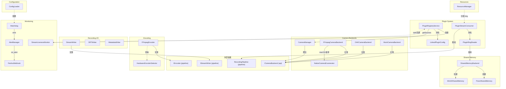
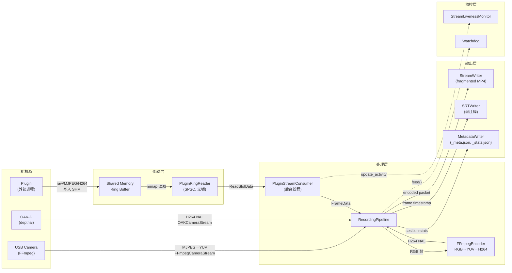
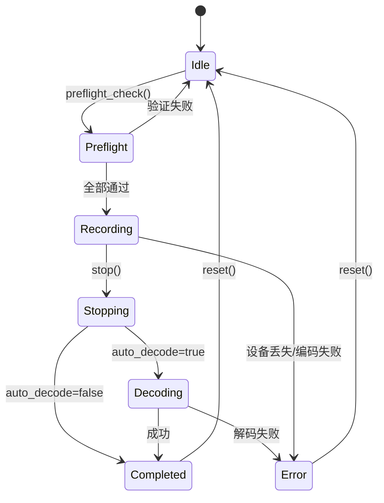
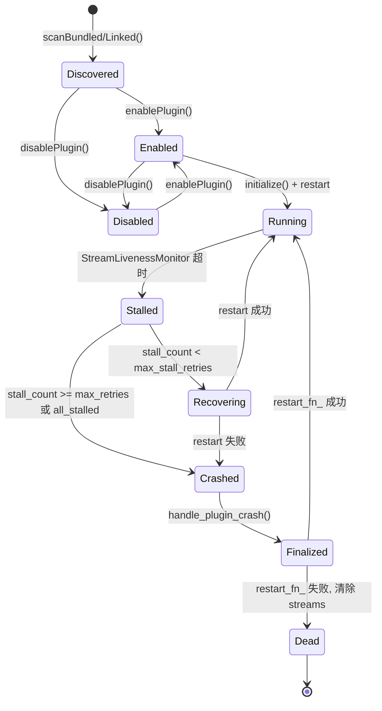
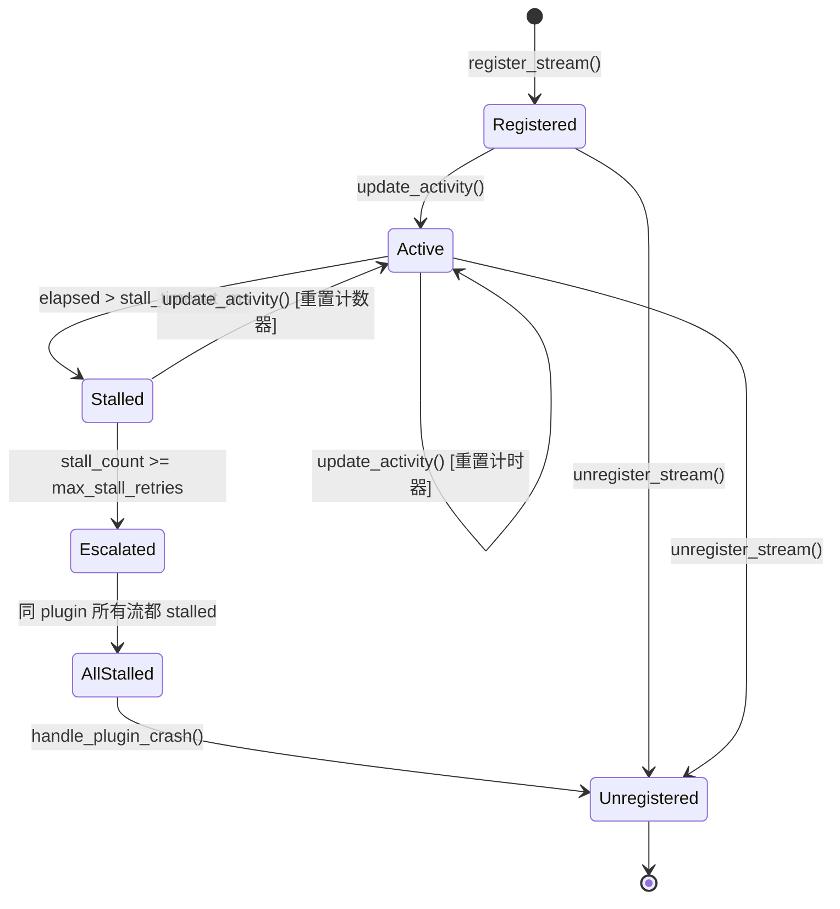

# MiceCam v2 — Infrastructure Layer Semantic Atlas

> 生成时间: 2026-05-22
> 范围: `internal/infrastructure/` 全部 46 文件（23 对 .h/.cpp）
> 命名空间: `micecam::infrastructure`

---

## S0 文件清单与子系统归属

| 子系统 | 文件 | 行数(.h+.cpp) | 职责 |
|--------|------|---------------|------|
| **Camera Backends** | `CameraManager.h/.cpp` | 37+76 | 后端聚合器，委托 discover/open，线程安全 |
| | `FFmpegCameraBackend.h/.cpp` | 23+273 | USB 相机后端，FFmpeg avdevice + AVFoundation |
| | `OAKCameraBackend.h/.cpp` | 23+157 | OAK-D 后端，depthai SDK 或 stub |
| | `MockCameraBackend.h/.cpp` | 58+148 | 测试用 mock 后端 |
| | `NativeCameraEnumerator.h` + `stub.cpp` | 18+9 | 平台原生相机枚举 |
| **Encoding** | `FFmpegEncoder.h/.cpp` | 42+281 | H264 编码器，硬件回退链 |
| | `HardwareEncoderSelector.h/.cpp` | 14+35 | 静态平台编码器检测工具 |
| **Recording I/O** | `StreamWriter.h/.cpp` | 32+143 | MP4 文件写入器，fragmented MP4 |
| | `SRTWriter.h/.cpp` | 33+110 | SRT 字幕文件写入器 |
| | `MetadataWriter.h/.cpp` | 18+121 | JSON 元数据/统计写入器 |
| **Configuration** | `ConfigLoader.h/.cpp` | 77+73 | 应用配置 18 键值对，JSON 持久化 |
| **Monitoring** | `Watchdog.h/.cpp` | 36+64 | 后台看门狗线程，200ms 轮询 |
| | `AlertManager.h/.cpp` | 42+62 | 观察者模式告警分发，5s 去重冷却 |
| | `FeishuWebhook.h/.cpp` | 29+65 | 飞书 Webhook 告警观察者（send 是 stub） |
| | `StreamLivenessMonitor.h/.cpp` | 60+109 | 每流活跃度监控，1s 轮询 |
| **Plugin System** | `PluginRingReader.h/.cpp` | 84+195 | 无锁 SPSC 环形缓冲区读取器 |
| | `PluginStreamConsumer.h/.cpp` | 83+147 | 消费环形帧并推入 RecordingPipeline |
| | `PluginRegistryService.h/.cpp` | 108+517 | 插件全生命周期管理，崩溃恢复 |
| | `LinkedPluginConfig.h/.cpp` | 32+125 | JSON 支持的链接插件目录配置 |
| **Shared Memory** | `SharedMemoryBackend.h/.cpp` | 27+19 | 抽象接口 + 工厂 |
| | `PosixSharedMemory.h/.cpp` | 20+66 | POSIX shm_open/mmap 实现 |
| | `Win32SharedMemory.h/.cpp` | 20+76 | Win32 CreateFileMapping 实现 |
| **Resources** | `ResourceManager.h/.cpp` | 75+200 | 流分配预算管理 |

**总计**: ~3,383 行源码

---

## S1 子系统关系图



---

## S2 核心流程伪代码

### 2.1 FFmpegEncoder::encode() — 编码路径

```pseudocode
FUNCTION encode(rgb_data, width, height, pts) -> bytes
    IF NOT ensure_context(width, height) THEN RETURN empty

    // 1. RGB24 → YUV420P 色彩空间转换
    IF sws_context 过期或尺寸变更 THEN
        sws_ctx_ = sws_getContext(w, h, RGB24 → w, h, YUV420P)
    END

    // 2. 分配 AVFrame, 执行 sws_scale
    frame = alloc_frame(YUV420P, w, h, pts)
    sws_scale(rgb_data → frame.data)
    avcodec_send_frame(frame)

    // 3. 接收编码后的 H264 NAL 包
    result = []
    WHILE avcodec_receive_packet(pkt) == 0 DO
        result.append(pkt.data)
    END
    RETURN result
END
```

### 2.2 PluginStreamConsumer::consumerLoop() — 帧消费循环

```pseudocode
FUNCTION consumerLoop()
    WHILE running DO
        slot = reader.readNextFrame(timeout=100ms)
        IF slot IS empty THEN CONTINUE

        // 更新活跃度监控
        monitor.update_activity(stream_id)

        // 增量统计
        delta_drops = reader.stats.total_drops - last_drops
        delta_bp = reader.stats.backpressure_events - last_bp

        // 构造 FrameData 推入管线
        frame = FrameData{stream_id, data, size, w, h, pts, format}
        pipeline.push_frame(frame)

        // 更新传输统计
        stats.frames_read++
        stats.frames_dropped += delta_drops
        update_lag_ema(reader.stats.current_lag)
    END
END
```

### 2.3 PluginRegistryService::handle_plugin_crash() — 崩溃恢复

```pseudocode
FUNCTION handle_plugin_crash(plugin_id) -> CrashRecoveryResult
    LOCK registry_mutex_

    // 1. 终结所有活跃流
    FOR stream_id IN plugin_streams_[plugin_id] DO
        log("Finalized stream " + stream_id)
        result.finalized_streams.append(stream_id)
    END

    // 2. 清理共享内存
    FOR shm_name IN plugin_shm_names_[plugin_id] DO
        shm_unlink_fn_(shm_name)
        result.cleaned_shm_names.append(shm_name)
    END
    plugin_shm_names_.erase(plugin_id)

    // 3. 尝试重启 (最多 max_restart_retries_ 次)
    restarted = false
    IF restart_fn_ EXISTS THEN
        FOR attempt = 0 .. max_restart_retries_-1 DO
            IF restart_fn_(plugin_id) THEN
                restarted = true; BREAK
            END
        END
    END

    // 4. 失败则清理流表
    IF NOT restarted THEN
        plugin_streams_.erase(plugin_id)
    END

    RETURN result
END
```

---

## S3 数据流图



---

## S4 状态机

### 4.1 录制生命周期



### 4.2 插件生命周期



### 4.3 流活跃度状态



---

## S5 调用图

```
CameraManager::discover_all()
  ├── lock(mutex_)
  └── for each backend: ICameraBackend::enumerate_devices()
        ├── FFmpegCameraBackend::enumerate_devices()
        │     ├── [macOS] enumerate_native_cameras()   ← NativeCameraEnumerator
        │     └── [Linux/Win] avdevice_list_input_sources()
        ├── OAKCameraBackend::enumerate_devices()
        │     └── [WITH_DEPTHAI] dai::Device::getAllAvailableDevices()
        └── MockCameraBackend::enumerate_devices()
              └── return hardcoded "mock_cam_0"

CameraManager::open_stream(config)
  ├── lock(mutex_)
  ├── find_backend_for_device() → ICameraBackend*
  └── ICameraBackend::open_stream(config)
        ├── FFmpegCameraBackend → FFmpegCameraStream (MJPEG decode loop)
        ├── OAKCameraBackend → OAKCameraStream (depthai queue)
        └── MockCameraBackend → MockCameraStream (gradient generator)

FFmpegEncoder::encode(rgb, w, h, pts)
  ├── ensure_context(w, h)
  │     └── try_open_context_with_fallback()
  │           ├── preferred codec (VideoToolbox/NVENC/QSV/VAAPI/AMF)
  │           ├── libx264 fallback
  │           └── any H264 encoder fallback
  ├── sws_scale(RGB24 → YUV420P)
  ├── avcodec_send_frame()
  └── WHILE avcodec_receive_packet() → collect NAL

StreamWriter::write_packet(data, size, pts, dts, keyframe)
  ├── lock(mutex_)
  ├── av_new_packet → memcpy → av_interleaved_write_frame
  └── packet_index_++

PluginStreamConsumer::consumerLoop() [后台线程]
  ├── reader_->readNextFrame(100ms timeout)
  │     ├── 原子读 producer_seq
  │     ├── backpressure 处理: skip frames if lag > slot_count
  │     ├── memcpy payload from mmap slot
  │     ├── checksum 校验
  │     └── 原子写 consumer_seq
  ├── monitor_->update_activity()
  └── pipeline_.push_frame(FrameData)

PluginRegistryService::handle_plugin_crash(plugin_id)
  ├── lock(registry_mutex_)
  ├── 终结所有 plugin_streams_[plugin_id]
  ├── shm_unlink_fn_() 每个 SHM
  └── restart_fn_(plugin_id) × max_restart_retries_

StreamLivenessMonitor::monitor_loop() [后台线程, 1s 轮询]
  ├── lock(mutex_)
  ├── for each stream: 检查 elapsed > stall_timeout_ms_
  │     ├── stall_cb_(stream_id, plugin_id, duration, count)
  │     └── 检查是否所有同 plugin 流都 stalled
  │           └── all_stalled_cb_(plugin_id)
  └── cycle_count_++

Watchdog::monitor_loop() [后台线程, 200ms 轮询]
  ├── 比较 now - last_feed_ns_ vs timeout
  └── 超时: alert_mgr_.emit(PIPELINE_STALL)

AlertManager::emit(alert)
  ├── lock(mutex_)
  ├── is_duplicate() → 去重冷却检查
  ├── history_.push_back(alert)
  └── for each observer: on_alert(alert)
        └── FeishuWebhook::on_alert()
              ├── format_payload() → JSON
              └── send() [STUB, 直接 return true]

ResourceManager::allocate(requests)
  ├── for each request:
  │     ├── check_conflicts() → exclusive_resource_id 冲突?
  │     ├── resolve_ring() → slot_count/slot_size/policy
  │     ├── check_budget() → streams/encoders/SHM 上限
  │     └── apply_allocation()
  └── return AllocationDecision[]
```

---

## S6 可变状态清单

| 类 | 成员 | 类型 | 线程安全 | 位置 |
|----|------|------|----------|------|
| `CameraManager` | `mutex_` | `std::mutex` | ✅ lock_guard | `CameraManager.h:32` |
| | `backends_` | `vector<unique_ptr<ICameraBackend>>` | ✅ via mutex_ | `:33` |
| | `plugin_registry_` | `PluginRegistryService*` | ❌ 裸指针无锁 | `:34` |
| `FFmpegEncoder` | `enc_ctx_` | `AVCodecContext*` | ❌ 无 mutex | `FFmpegEncoder.h:31` |
| | `active_codec_` | `const AVCodec*` | ❌ | `:32` |
| | `sws_ctx_` | `SwsContext*` | ❌ | `:33` |
| | `enc_width_`, `enc_height_` | `int` | ❌ | `:34-35` |
| | `sws_src_width_`, `sws_src_height_` | `int` | ❌ | `:36-37` |
| | `active_encoder_` | `string` | ❌ | `:38` |
| | `stored_config_` | `EncoderConfig` | ❌ | `:39` |
| `StreamWriter` | `mutex_` | `std::mutex` | ✅ | `StreamWriter.h:26` |
| | `fmt_ctx_` | `AVFormatContext*` | ✅ via mutex_ | `:27` |
| | `stream_` | `AVStream*` | ✅ via mutex_ | `:28` |
| | `packet_index_` | `int64_t` | ✅ via mutex_ | `:29` |
| `SRTWriter` | `mutex_` | `std::mutex` | ✅ | `SRTWriter.h:25` |
| | `file_` | `FILE*` | ✅ via mutex_ | `:26` |
| | `entry_count_` | `uint64_t` | ✅ via mutex_ | `:27` |
| | `fps_` | `double` | ✅ via mutex_ | `:28` |
| `Watchdog` | `timeout_s_` | `atomic<int>` | ✅ | `Watchdog.h:29` |
| | `running_` | `atomic<bool>` | ✅ | `:30` |
| | `last_feed_ns_` | `atomic<uint64_t>` | ✅ | `:31` |
| | `thread_` | `std::thread` | ✅ join-based | `:32` |
| `AlertManager` | `mutex_` | `std::mutex` | ✅ | `AlertManager.h:26` |
| | `history_` | `vector<AlertRecord>` | ✅ via mutex_ | `:27` |
| | `observers_` | `vector<WatchdogObserver*>` | ✅ via mutex_ | `:28` |
| | `dedup_cooldown_ms_` | `int` | ✅ via mutex_ | `:29` |
| | `last_emit_` | `map<DedupKey, time_point>` | ✅ via mutex_ | `:39` |
| `FeishuWebhook` | `url_` | `string` | ✅ via mutex_ | `FeishuWebhook.h:25` |
| `StreamLivenessMonitor` | `running_` | `atomic<bool>` | ✅ | `StreamLivenessMonitor.h:45` |
| | `stop_requested_` | `atomic<bool>` | ✅ | `:46` |
| | `cycle_count_` | `atomic<int>` | ✅ | `:47` |
| | `last_active_` | `unordered_map<string, time_point>` | ✅ via mutex_ | `:51` |
| | `stream_to_plugin_` | `unordered_map<string, string>` | ✅ via mutex_ | `:52` |
| | `stall_counts_` | `unordered_map<string, int>` | ✅ via mutex_ | `:53` |
| `PluginRingReader` | `mapped_mem_` | `void*` | ❌ 单线程写入 | `PluginRingReader.h:67` |
| | `header_->producer_seq` | `atomic<uint64_t>` | ✅ 原子操作 | `:16` |
| | `header_->consumer_seq` | `atomic<uint64_t>` | ✅ 原子操作 | `:17` |
| | `next_consumer_seq_` | `uint64_t` | ❌ 单消费者 | `:72` |
| | `total_reads_`, `total_drops_`, etc. | `uint64_t` | ✅ via stats_mutex_ | `:75-79` |
| `PluginStreamConsumer` | `consumer_stop_` | `atomic<bool>` | ✅ | `PluginStreamConsumer.h:70` |
| | `running_` | `atomic<bool>` | ✅ | `:72` |
| | `transport_stats_` | `TransportStats` | ✅ via stats_mutex_ | `:75` |
| | `lag_sum_`, `lag_max_` | `double` | ✅ via stats_mutex_ | `:79-80` |
| `PluginRegistryService` | `registry_mutex_` | `std::mutex` | ✅ | `PluginRegistryService.h:88` |
| | `plugins_` | `vector<PluginDescriptor>` | ⚠️ 初始化后读无锁 | `:80` |
| | `plugin_streams_` | `unordered_map` | ✅ via registry_mutex_ | `:85` |
| | `plugin_shm_names_` | `unordered_map` | ✅ via registry_mutex_ | `:86` |
| | `pending_restart_` | `bool` | ❌ 无锁 | `:82` |
| | `initialized_` | `bool` | ❌ 无锁 | `:83` |
| `ConfigLoader` | 全部 18 个配置字段 | scalar types | ❌ 假定单线程 | `ConfigLoader.h:56-74` |
| `ResourceManager` | `allocations_` | `unordered_map` | ❌ 假定单线程 | `ResourceManager.h:71` |
| | `locked_resources_` | `unordered_set` | ❌ 假定单线程 | `:72` |
| `MockCameraStream` | `is_open_` | `atomic<bool>` | ✅ | `MockCameraBackend.h:33` |
| | `frame_counter_` | `int64_t` | ✅ via mutex_ | `:35` |

---

## S7 函数契约

### 7.1 Camera Backends

| 函数签名 | 前置条件 | 后置条件 | 失败返回 |
|----------|----------|----------|----------|
| `CameraManager::register_backend(uptr<ICameraBackend>)` | — | backends_ 增加 1 个元素 | — |
| `CameraManager::discover_all() -> vector<DeviceInfo>` | 至少 1 个 backend 已注册 | 合并所有后端枚举结果 | 空向量 |
| `CameraManager::open_stream(config) -> uptr<CameraStream>` | device_id 存在于某个后端 | 返回活跃 CameraStream | `nullptr` |
| `FFmpegCameraBackend::enumerate_devices()` | FFmpeg 已初始化 | 返回可用 USB 设备列表 | 空向量 |
| `FFmpegCameraBackend::open_stream(config)` | config.device_id 有效 | 返回 MJPEG→YUV 解码流 | `nullptr` |
| `OAKCameraBackend::open_stream(config)` | WITH_DEPTHAI 且设备在线 | 返回 H264 码流 | `nullptr` |
| `MockCameraBackend::open_stream(config)` | device_id 以 "mock_cam_" 开头 | 返回 RGB 渐变生成流 | `nullptr` |

### 7.2 Encoding

| 函数签名 | 前置条件 | 后置条件 | 失败返回 |
|----------|----------|----------|----------|
| `FFmpegEncoder::initialize(config)` | — | active_codec_ 已选定 | `false` |
| `FFmpegEncoder::encode(rgb, w, h, pts) -> bytes` | initialize() 成功 | H264 NAL 字节 | 空向量 |
| `FFmpegEncoder::flush(out) -> bool` | enc_ctx_ 非 null | 剩余帧已刷出 | `false` |
| `HardwareEncoderSelector::detect_platform_encoder()` | — | 返回平台首选编码器名 | "libx264" |

### 7.3 Recording I/O

| 函数签名 | 前置条件 | 后置条件 | 失败返回 |
|----------|----------|----------|----------|
| `StreamWriter::open(path, w, h, fps)` | 路径可写 | fMP4 header 已写入 | `false` |
| `StreamWriter::write_packet(data, size, pts, dts, keyframe)` | 已 open | 包已写入 | `false` |
| `StreamWriter::close()` | 已 open | trailer 已写, 文件已关 | `false` |
| `SRTWriter::write_entry(seq, ts, skipped)` | 已 open | 1 条 SRT entry 已刷新到磁盘 | — |
| `MetadataWriter::write_session_header(meta, path)` | — | JSON 文件已创建 | `false` |
| `MetadataWriter::write_session_footer(path, ...)` | header 已写 | footer 字段已追加 | `false` |

### 7.4 Plugin System

| 函数签名 | 前置条件 | 后置条件 | 失败返回 |
|----------|----------|----------|----------|
| `PluginRingReader::open(shm_name)` | SHM 存在且 ≥ 64 bytes | 映射完成, consumer_seq 已同步 | `false` |
| `PluginRingReader::readNextFrame(out, timeout)` | 已 open | 填充 ReadSlotData | `false` (超时) |
| `PluginStreamConsumer::start()` | 未运行 | reader 已打开, 线程已启动 | `false` |
| `PluginStreamConsumer::stop()` | 正在运行 | 线程已 join, reader 已关闭 | — |
| `PluginRegistryService::initialize()` | — | 扫描目录, monitor 已启动 | `false` |
| `PluginRegistryService::handle_plugin_crash(id)` | — | 流终结, SHM 清理, 重试重启 | CrashRecoveryResult |

---

## S8 副作用清单

| 类别 | 函数 | 副作用 |
|------|------|--------|
| **文件 I/O** | `StreamWriter::open/write_packet/close` | 创建/写入/关闭 MP4 文件 |
| | `SRTWriter::open/write_entry/close` | 创建/写入/关闭 SRT 文件 |
| | `MetadataWriter::write_*` | 创建/覆写 JSON 文件 |
| | `ConfigLoader::load/save` | 读写配置 JSON 文件 |
| | `LinkedPluginConfig::load/save` | 读写 linked_plugins.json |
| **网络 I/O** | `FeishuWebhook::send` | **STUB — 当前无实际 HTTP 请求** |
| **共享内存** | `PosixSharedMemory::open/map/unmap/unlink` | shm_open, mmap, munmap, shm_unlink |
| | `Win32SharedMemory::open/map/unmap` | CreateFileMapping, MapViewOfFile, CloseHandle |
| **线程创建** | `Watchdog::start` | 启动 monitor_loop 后台线程 |
| | `StreamLivenessMonitor::start` | 启动 monitor_loop 后台线程 |
| | `PluginStreamConsumer::start` | 启动 consumerLoop 后台线程 |
| **状态变更** | `AlertManager::emit` | 修改 history_, last_emit_, 调用所有观察者 |
| | `PluginRegistryService::register_stream/unregister_stream` | 修改 plugin_streams_, 调用 monitor |
| | `ResourceManager::allocate/release` | 修改 allocations_, locked_resources_ |
| **硬件** | `FFmpegCameraBackend::open_stream` | 打开 USB 相机设备 |
| | `OAKCameraBackend::open_stream` | 初始化 depthai Pipeline, 启动 OAK 设备 |
| | `FFmpegEncoder::ensure_context` | 初始化/切换硬件编码器上下文 |

---

## S9 风险评估

### 9.1 线程安全问题

| 风险 | 严重度 | 位置 | 说明 |
|------|--------|------|------|
| **FFmpegEncoder 无 mutex** | 🔴 高 | `FFmpegEncoder.h:31-39` | 所有可变状态（enc_ctx_, sws_ctx_ 等）无保护。若 encode() 被多线程并发调用，AVCodecContext 内部状态会崩溃。当前依赖调用方序列化（RecordingPipeline），但契约未文档化。 |
| **CameraManager::plugin_registry_ 无锁** | 🟡 中 | `CameraManager.h:34` | `set_plugin_registry()` 和 `get_sources()` 未持锁访问裸指针。若 set 和 get 并发调用，存在 use-after-free 风险。 |
| **PluginRegistryService::plugins_ 初始化后无锁读** | 🟡 中 | `PluginRegistryService.h:80` | `getPlugins()` 和 `getSources()` 直接遍历 plugins_ 无 mutex。若 enablePlugin/disablePlugin 与读取并发，存在数据竞争。 |
| **ConfigLoader 全局无锁** | 🟡 中 | `ConfigLoader.h:56-74` | 18 个配置字段全部无保护。假定单线程，但若 UI 线程和 worker 线程同时访问可能出错。 |
| **ResourceManager 无锁** | 🟢 低 | `ResourceManager.h:71-72` | 假定由 session orchestrator 单线程调用。若未来在并发场景使用需加锁。 |
| **PluginRegistryService::pending_restart_** | 🟡 中 | `PluginRegistryService.h:82` | 非 atomic bool，UI 线程读和操作线程写可能竞争。 |

### 9.2 无锁环形缓冲区竞争

| 风险 | 说明 |
|------|------|
| **生产者崩溃时消费者挂起** | `PluginRingReader::readNextFrame()` 自旋等待 producer_seq 更新。若插件进程崩溃（OS 清理 SHM 不一定即时），消费者将超时后返回 false，不会永久阻塞，但 timeout_ms 期间占用 CPU。 |
| **背压丢帧静默** | lag > slot_count 时直接跳帧，虽有日志但统计中只计 backpressure_events。下游管线无法区分"无数据"和"数据被跳过"。 |
| **checksum 仅 XOR 前 256 字节** | `computeChecksum()` 只异或前 64 个 uint32，对大帧（如 4K RAW）碰撞概率高，无法检测部分数据损坏。 |

### 9.3 跨平台 SHM

| 风险 | 说明 |
|------|------|
| **Win32 SHM unlink 是空操作** | `Win32SharedMemory::unlink()` 是 no-op。Windows 上共享内存句柄随最后一个 CloseHandle 自动释放，但异常退出时可能残留。 |
| **fd 转型为 int** | `Win32SharedMemory::open()` 将 HANDLE reinterpret_cast 为 int。64 位平台上 HANDLE 可能截断（虽然实际 Windows HANDLE 是 32-bit 对齐）。 |
| **PosixSharedMemory::open 双次尝试** | 先 O_EXCL 创建再 O_RDWR 打开，竞态窗口中两个进程可能同时创建。 |

### 9.4 编码器回退链

| 风险 | 说明 |
|------|------|
| **硬编码 FPS=30** | `open_codec_context()` 和 `ensure_context()` 中 fps 硬编码为 30，忽略实际流帧率。 |
| **VideoToolbox max_b_frames=0** | 硬件编码器限制 B 帧为 0，压缩效率低于软件编码器，但延迟更低。 |
| **ensure_context 尺寸变更重建** | 每次分辨率变化都 avcodec_free_context + 重新 alloc。运行中切换分辨率会产生编码间隙。 |

### 9.5 Stub / 空实现

| 风险 | 说明 |
|------|------|
| **FeishuWebhook::send()** | 完全是 stub，直接 return true。所有告警将被"成功发送"但实际上不会到达飞书。生产环境必须实现 HTTP POST。 |
| **OAKCameraBackend 无 depthai** | stub 编译路径返回空列表和 nullptr，不做任何运行时警告。用户可能困惑为什么没有 OAK 设备。 |

### 9.6 资源泄漏

| 风险 | 说明 |
|------|------|
| **FFmpegCameraStream 不释放流** | close() 释放了 codec/frame/format context，但不发送 flush。编码器可能丢失最后几帧。 |
| **StreamWriter 析构不写 trailer** | 析构函数只 avio_close + avformat_free_context，跳过 av_write_trailer。正常关闭必须调用 close()。 |

---

## S10 功能需求映射

| 需求 ID | 需求名称 | 实现组件 | 覆盖状态 |
|---------|----------|----------|----------|
| FR-1 | 插件注册与发现 | `PluginRegistryService` (scanBundled/scanLinked), `LinkedPluginConfig` | ✅ 完整 |
| FR-2 | 插件清单 | `PluginRegistryService::registerPlugin()` 解析 plugin.json → PluginManifest | ✅ 完整 |
| FR-3 | 导入与验证 | `PluginRegistryService::addLinkedDirectory()` 含 JSON 验证 | ⚠️ 缺路径穿越检查和可执行文件验证 |
| FR-4 | 进程模型 | `ResourceManager::resolve_process_model()` | ✅ 完整 |
| FR-5 | gRPC 控制合约 | 本层不涉及（gRPC 在 plugin 外部进程） | N/A |
| FR-6 | 共享内存帧传输 | `PluginRingReader`, `SharedMemoryBackend`, `PosixSharedMemory`, `Win32SharedMemory` | ✅ 完整 |
| FR-7 | 输出规范化 | `StreamWriter` (MP4), `SRTWriter` (.srt), `MetadataWriter` (_meta.json, _stats.json), `FFmpegEncoder` (H264) | ✅ 完整 |
| FR-8 | 配置 Schema | 本层不涉及（schema 在 plugin 进程侧） | N/A |
| FR-9 | 设备模型与分组 UI | `CameraManager::get_sources()`, `get_devices_for_source()` | ✅ 完整 |
| FR-10 | 冲突与独占资源 | `ResourceManager::check_conflicts()` + exclusive_resource_id 锁定 | ✅ 完整 |
| FR-11 | 资源管理 | `ResourceManager` (streams/encoders/SHM 预算) | ✅ 完整 |
| FR-12 | 错误与恢复 | `PluginRegistryService::handle_plugin_crash()`, `StreamLivenessMonitor`, `Watchdog`, `AlertManager` | ✅ 完整 |
| FR-13 | 会话元数据快照 | `MetadataWriter::write_session_header/footer()` | ✅ 完整 |

---

## S11 测试覆盖分析

| 子系统 | 单元测试存在 | 集成测试 | 不足之处 |
|--------|-------------|----------|----------|
| CameraManager | ⚠️ 未在 infrastructure 测试目录中找到独立测试 | — | discover_all 和 open_stream 缺少 mock backend 的并发测试 |
| FFmpegCameraBackend | ⚠️ 需要实际 USB 设备 | — | 无法在 CI 中测试 enumerate_devices |
| OAKCameraBackend | ❌ | — | WITH_DEPTHAI 路径需要硬件 |
| MockCameraBackend | ✅ 用于其他测试 | — | 自身测试充分 |
| FFmpegEncoder | ⚠️ | — | 缺少多线程 encode 并发测试、硬编码 FPS=30 的测试 |
| HardwareEncoderSelector | ✅ 静态逻辑易测 | — | — |
| StreamWriter | ⚠️ | — | 缺少大文件、异常关闭后的文件完整性测试 |
| SRTWriter | ⚠️ | — | — |
| MetadataWriter | ⚠️ | — | — |
| Watchdog | ⚠️ | — | 缺少超时触发的精确时序测试 |
| AlertManager | ⚠️ | — | 去重冷却的边界条件未测试 |
| FeishuWebhook | ❌ send() 是 stub | — | 无法测试实际 HTTP 发送 |
| StreamLivenessMonitor | ⚠️ 可注入 ClockFn | — | — |
| PluginRingReader | ⚠️ | — | 缺少生产者崩溃、SHM 损坏的测试 |
| PluginStreamConsumer | ⚠️ | — | — |
| PluginRegistryService | ⚠️ | — | 崩溃恢复的完整流程测试不足 |
| ResourceManager | ⚠️ | — | 预算耗尽边界、release_all 后状态验证 |
| SharedMemoryBackend | ⚠️ | — | 跨进程测试 |

---

## S12 关键函数完整伪代码

### 12.1 PluginRingReader::readNextFrame()

```
FUNCTION readNextFrame(out, timeout_ms) -> bool
    IF NOT mapped_mem_ THEN RETURN false

    deadline = now + timeout_ms

    WHILE true DO
        producer = header_->producer_seq.load(acquire)

        // 消费者已追上生产者 — 等待新数据
        IF next_consumer_seq_ >= producer THEN
            IF now >= deadline THEN RETURN false
            sleep(500μs)
            CONTINUE
        END

        // 背压检测：lag 超过 ring 容量
        lag = producer - next_consumer_seq_
        IF lag > slot_count_ THEN
            skip_count = lag - slot_count_
            next_consumer_seq_ = producer - slot_count_
            total_drops_ += skip_count
            backpressure_events_++
            LOG_WARN("backpressure: skipped {skip_count} frames")
            CONTINUE
        END

        // 定位 slot 并读取 payload header
        slot_index = next_consumer_seq_ % slot_count_
        slot_ptr = mapped_mem_ + 64 + slot_index * slot_size_
        readPayloadHeader(slot_ptr, out)

        // 拷贝 payload 数据
        copy_size = min(out.payload_size, slot_size_ - 44)
        out.data.resize(copy_size)
        memcpy(out.data, slot_ptr + 44, copy_size)

        // 校验和（仅前 256 字节）
        actual_checksum = computeChecksum(out.data, copy_size)
        IF actual_checksum != out.checksum THEN
            LOG_WARN("checksum mismatch seq={out.sequence}")
        END

        // 推进消费者序列
        next_consumer_seq_++
        header_->consumer_seq.store(next_consumer_seq_, release)

        // 更新统计
        total_reads_++
        current_lag_ = producer_seq - next_consumer_seq_
        max_lag_ = max(max_lag_, current_lag_)

        RETURN true
    END
END
```

### 12.2 ResourceManager::allocate()

```
FUNCTION allocate(requests) -> vector<AllocationDecision>
    decisions = []
    FOR req IN requests DO
        decision.stream_id = req.stream_id

        // 去重检查
        IF is_allocated(req.stream_id) THEN
            decision.accepted = false
            decision.reason = "already allocated"
            decisions.push(decision)
            CONTINUE
        END

        // 独占资源冲突检查
        IF req.exclusive_resource_id EXISTS AND
           locked_resources_ 包含该 id THEN
            decision.accepted = false
            decision.reason = "exclusive resource conflict"
            decisions.push(decision)
            CONTINUE
        END

        // 解析 ring buffer 参数
        ring = resolve_ring(req)
            slot_size = req.min_slot_size ?: (recording ? 4MB : 1MB)
            slot_count = req.min_slot_count ?: 4
            policy = recording ? NO_DROP : LATEST_FRAME

        // 预算检查
        IF active_stream_count + 1 > max_streams THEN REJECT
        IF active_encoders + req.slots > max_encoders THEN REJECT
        IF active_shm + ring_bytes > max_shm THEN REJECT

        // 接受分配
        decision.accepted = true
        decision.ring = ring
        decision.resolved_process_model = resolve_process_model(req)
        decisions.push(decision)
        apply_allocation(decision, req)
    END
    RETURN decisions
END
```

### 12.3 AlertManager::emit() 去重逻辑

```
FUNCTION emit(alert)
    LOCK mutex_

    // 去重: 同 type + stream_id 在 cooldown 期间不重复发送
    key = {alert.type, alert.stream_id}
    IF last_emit_ 包含 key THEN
        elapsed = now - last_emit_[key]
        IF elapsed < dedup_cooldown_ms_ THEN RETURN  // 被去重
    END

    // 记录本次发送时间
    last_emit_[key] = now

    // 追加历史
    history_.push_back(alert)

    // 通知所有观察者
    FOR obs IN observers_ DO
        obs->on_alert(alert)
    END
END
```

---

## S13 审计结论

### 架构健康度: 7.5/10

**优势**:
1. **清晰的子系统分层** — Camera/Encoding/IO/Monitor/Plugin/SHM 六个子系统边界清晰，每个文件职责单一。
2. **观察者模式告警** — AlertManager + WatchdogObserver 解耦良好，飞书集成只需实现 send()。
3. **无锁 SPSC ring buffer** — PluginRingReader 的原子 producer/consumer seq 设计正确，背压处理有明确策略。
4. **跨平台 SHM 抽象** — SharedMemoryBackend 工厂模式干净，Posix/Win32 实现完全隔离。
5. **编码器硬件回退链** — 6 级回退保证在任何平台都能编码。
6. **ResourceManager 预算管理** — 流/编码器/SHM 三重预算约束，exclusive_resource_id 冲突检测完整。

**需关注**:
1. **FFmpegEncoder 线程安全** — 无 mutex 保护。若 RecordingPipeline 保证单线程调用则可接受，但应在接口文档中明确标注 `@thread_safety: NOT thread-safe`。
2. **FeishuWebhook::send() 是空壳** — 生产环境上线前必须实现，否则告警静默丢失。
3. **ConfigLoader 和 ResourceManager 无并发保护** — 当前假定单线程访问是合理的，但应为未来并发访问预留文档化约束。
4. **PluginRegistryService::plugins_ 读写竞争** — enablePlugin() 写入与 getSources() 读取可能并发，应考虑加 registry_mutex_ 或标记为 single-threaded。
5. **PluginRingReader checksum 过弱** — XOR 前 256 字节不足以检测大帧数据损坏，建议使用 CRC32。
6. **StreamWriter 析构不写 trailer** — 异常路径可能导致 MP4 文件不完整，应在析构函数中添加 best-effort trailer 写入。

**技术债指标**:

| 指标 | 值 |
|------|---|
| 线程安全缺陷 | 3 高, 4 中 |
| Stub/空实现 | 2 处 (FeishuWebhook::send, OAK stub) |
| 硬编码常量 | FPS=30, 轮询间隔 200ms/1s, 默认 slot_size 4MB |
| 缺失输入验证 | PluginRegistry 缺路径穿越检查, ConfigLoader 无 schema 验证 |
| 资源泄漏风险 | StreamWriter 析构跳过 trailer |
| 跨平台差异 | Win32 SHM unlink no-op, fd/HANDLE 类型转换 |
