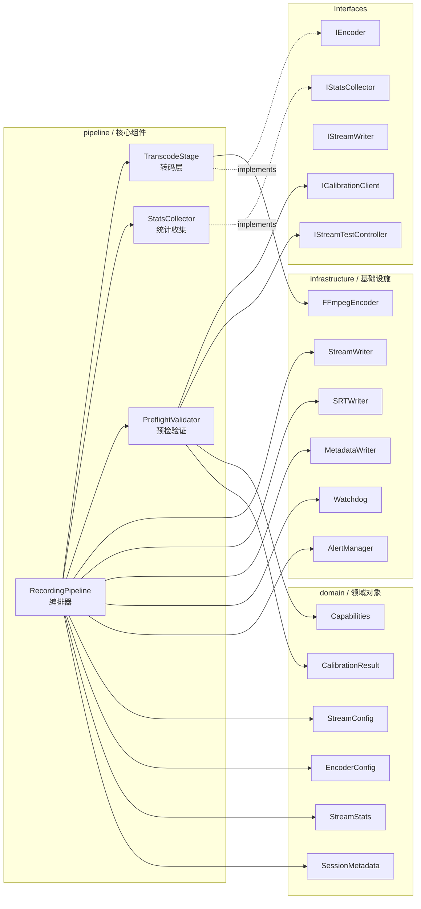
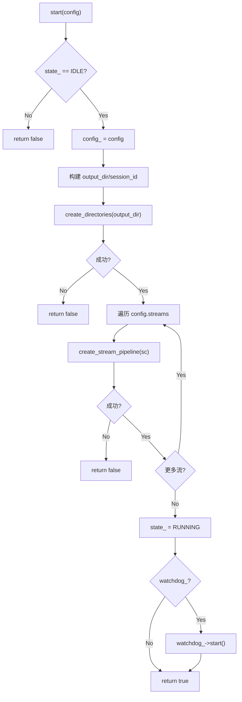
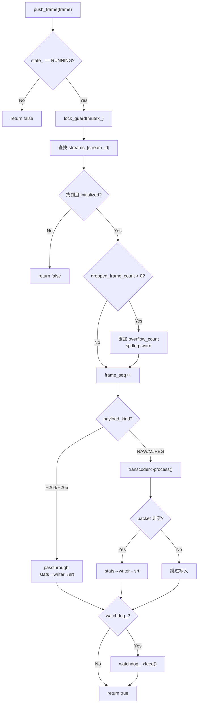
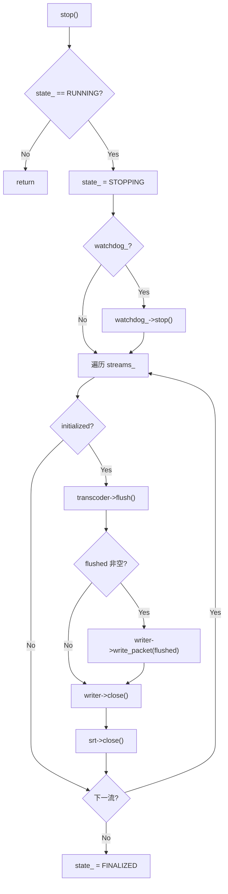
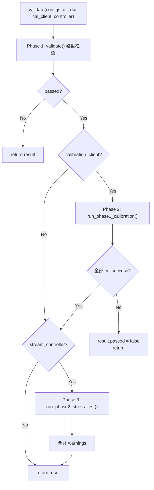
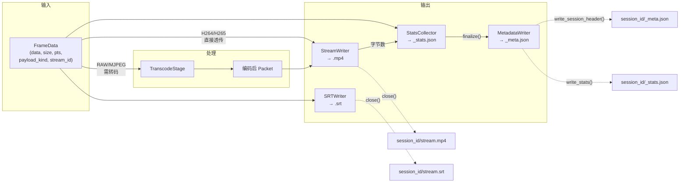
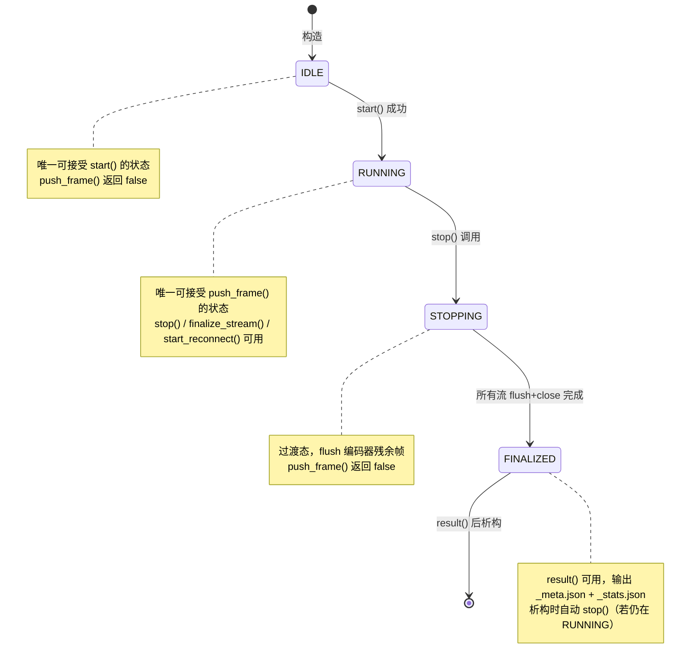
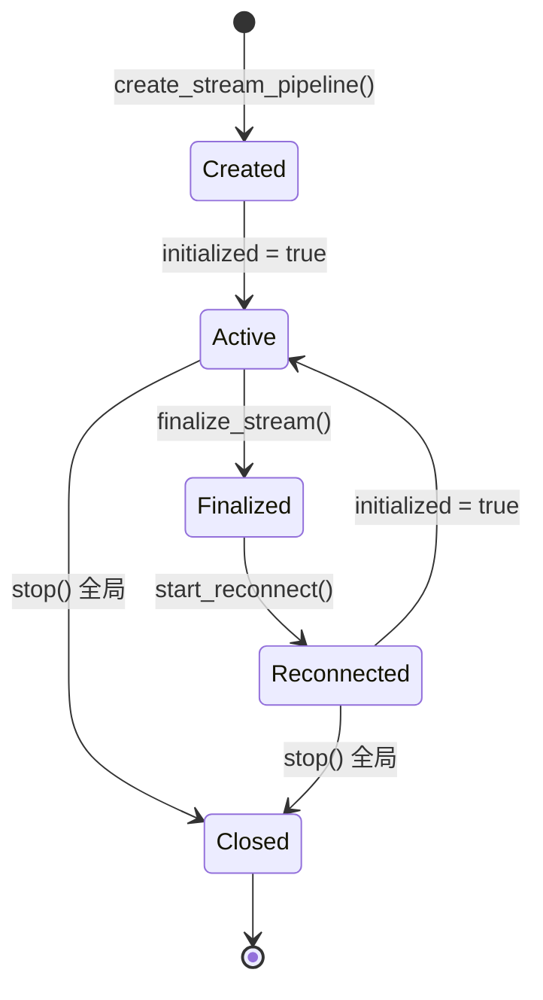

# Semantic Atlas: `internal/pipeline/`

> Generated: 2026-05-22 | Auditor: code-semantic-auditor | Target: `micecam::pipeline` namespace

---

## S0: 一屏摘要

| 文件 | 行数 | 职责 | 核心类型 | 依赖层级 |
|------|------|------|----------|----------|
| `RecordingPipeline.h/.cpp` | 118+300 | 录制管线核心编排器：生命周期管理、帧分发、输出文件管理 | `RecordingPipeline`, `StreamPipeline`, `SessionConfig`, `FrameData`, `PipelineState` | pipeline → infrastructure + domain |
| `TranscodeStage.h/.cpp` | 33+42 | 转码薄封装：passthrough 或委托 FFmpegEncoder | `TranscodeStage` | pipeline → infrastructure |
| `StatsCollector.h/.cpp` | 47+70 | 每流统计累加器：帧数/延迟/字节/告警 | `StatsCollector` | pipeline → domain |
| `PreflightValidator.h/.cpp` | 89+312 | 多阶段预检：磁盘/能力/校准/压力测试 | `PreflightValidator`, `PreflightResult`, `StressTestResult`, `ICalibrationClient`, `IStreamTestController` | pipeline → domain + OS |
| `IEncoder.h` | 21 | 编码器接口契约 | `IEncoder` | pipeline → domain |
| `IStatsCollector.h` | 20 | 统计收集器接口契约 | `IStatsCollector` | pipeline → domain |
| `IStreamWriter.h` | 17 | 流写入器接口契约 | `IStreamWriter` | pipeline (纯接口) |

**总行数**: ~1,022 | **接口**: 3 | **实现类**: 4 | **枚举**: 2 (`PipelineState`, `PreflightSeverity`)

---

## S1: 模块框架图



---

## S2: 核心执行流程图

### 2a: `RecordingPipeline::start()`



### 2b: `RecordingPipeline::push_frame()`



### 2c: `RecordingPipeline::stop()`



### 2d: `PreflightValidator::validate()` (完整5阶段)



---

## S3: 数据流图



---

## S4: 状态机图

### 4a: PipelineState



### 4b: StreamPipeline 生命周期



---

## S5: 函数调用图

```mermaid
flowchart TD
    RP_START["RecordingPipeline::start()"] --> RP_CSP["create_stream_pipeline()"]
    RP_CSP --> TS_INIT["TranscodeStage::initialize()"]
    RP_CSP --> SW_OPEN["StreamWriter::open()"]
    RP_CSP --> SRT_OPEN["SRTWriter::open()"]
    RP_CSP --> SC_START["StatsCollector::start()"]
    RP_CSP --> WD_START["Watchdog::start()"]

    RP_PUSH["RecordingPipeline::push_frame()"] --> TS_PROC["TranscodeStage::process()"]
    TS_PROC --> FF_ENC["FFmpegEncoder::encode()"]
    RP_PUSH --> SC_REC["StatsCollector::record_frame()"]
    RP_PUSH --> SC_ENC["StatsCollector::set_encoder()"]
    RP_PUSH --> SW_WRITE["StreamWriter::write_packet()"]
    RP_PUSH --> SRT_WRITE["SRTWriter::write_entry()"]
    RP_PUSH --> SC_BYTES["StatsCollector::add_bytes()"]
    RP_PUSH --> WD_FEED["Watchdog::feed()"]

    RP_STOP["RecordingPipeline::stop()"] --> TS_FLUSH["TranscodeStage::flush()"]
    TS_FLUSH --> FF_FLUSH["FFmpegEncoder::flush()"]
    RP_STOP --> SW_CLOSE["StreamWriter::close()"]
    RP_STOP --> SRT_CLOSE["SRTWriter::close()"]
    RP_STOP --> WD_STOP["Watchdog::stop()"]

    RP_RESULT["RecordingPipeline::result()"] --> SC_FINAL["StatsCollector::finalize()"]
    RP_RESULT --> MW_META["MetadataWriter::write_session_header()"]
    RP_RESULT --> MW_STATS["MetadataWriter::write_stats()"]

    RP_FINAL["RecordingPipeline::finalize_stream()"] --> TS_FLUSH2["TranscodeStage::flush()"]
    RP_FINAL --> SW_CLOSE2["StreamWriter::close()"]
    RP_FINAL --> SRT_CLOSE2["SRTWriter::close()"]

    RP_RECONN["RecordingPipeline::start_reconnect()"] --> SW_OPEN2["StreamWriter::open()"]
    RP_RECONN --> SRT_OPEN2["SRTWriter::open()"]

    PV_DISK["PreflightValidator::check_disk_space()"] --> STATFS["statvfs / GetDiskFreeSpaceEx"]

    PV_CAPS["PreflightValidator::check_capabilities()"]
    PV_VSC["PreflightValidator::validate_stream_capabilities()"]

    PV_CAL["PreflightValidator::run_phase1_calibration()"] --> ICL_CAL["ICalibrationClient::calibrate()"]
    PV_CAL --> PV_CAL_RETRY["client->calibrate() (降级重试)"]
    PV_CAL --> PV_GOP["compute_min_gop()"]

    PV_STRESS["PreflightValidator::run_phase2_stress_test()"] --> ITC_OPEN["IStreamTestController::openStream()"]
    PV_STRESS --> ITC_DROP["IStreamTestController::getDropCount()"]
    PV_STRESS --> ITC_CLOSE["IStreamTestController::closeStream()"]

    PV_VAL["PreflightValidator::validate(5参数)"] --> PV_DISK
    PV_VAL --> PV_CAL
    PV_VAL --> PV_STRESS
```



---

## S6: 状态变量表

### RecordingPipeline

| 变量 | 类型 | 作用域 | 线程安全 | 初始值 | 生命周期 |
|------|------|--------|----------|--------|----------|
| `state_` | `atomic<PipelineState>` | 私有 | 原子操作 | `IDLE` | start→RUNNING, stop→STOPPING→FINALIZED |
| `mutex_` | `mutex` | 私有 | 锁守卫 | - | push_frame / finalize_stream / start_reconnect / set_* |
| `streams_` | `unordered_map<string, unique_ptr<StreamPipeline>>` | 私有 | 受 mutex_ 保护 | 空 | start() 填充, stop() 关闭, 析构释放 |
| `config_` | `SessionConfig` | 私有 | 无锁（start后只读） | 默认 | start() 赋值, result() 读取 |
| `watchdog_` | `Watchdog*` | 私有 | 非拥有指针 | `nullptr` | 外部 set_watchdog() |
| `alert_mgr_` | `AlertManager*` | 私有 | 非拥有指针 | `nullptr` | 外部 set_alert_manager() |
| `plugin_source_` | `nlohmann::json` | 私有 | 受 mutex_ 保护 | 空 | set_plugin_source() |
| `stream_transport_stats_` | `unordered_map<string, json>` | 私有 | 受 mutex_ 保护 | 空 | set_stream_transport_stats() |

### StreamPipeline

| 变量 | 类型 | 说明 |
|------|------|------|
| `transcoder` | `unique_ptr<TranscodeStage>` | 转码器实例 |
| `writer` | `unique_ptr<StreamWriter>` | MP4 写入器 |
| `srt` | `unique_ptr<SRTWriter>` | SRT 时间戳写入器 |
| `stats` | `unique_ptr<StatsCollector>` | 统计收集器 |
| `stream_id` | `string` | `device_id + "_" + stream_index` |
| `output_prefix` | `string` | 输出文件前缀（reconnect 时追加后缀） |
| `width/height/fps` | `int` | 流参数（带默认值 1920/1080/30） |
| `frame_seq` | `uint64_t` | 帧序号计数器 |
| `initialized` | `bool` | 流是否就绪 |
| `fallback_gop_size` | `int` | 来自 calibration 或默认 60 |
| `overflow_count` | `uint64_t` | ring buffer 溢出累计 |

### StatsCollector

| 变量 | 类型 | 作用域 | 线程安全 |
|------|------|--------|----------|
| `mutex_` | `mutex` | 私有 | 所有方法 lock |
| `frames_expected_` | `uint64_t` | 私有 | 受 mutex_ 保护 |
| `frames_actual_` | `uint64_t` | 私有 | 受 mutex_ 保护 |
| `encode_sum/min/max_us_` | `double` | 私有 | 受 mutex_ 保护 |
| `frame_interval_sum_us_` | `double` | 私有 | 受 mutex_ 保护 |
| `frame_interval_max_deviation_us_` | `double` | 私有 | 受 mutex_ 保护 |
| `expected_frame_interval_us_` | `uint64_t` | 私有 | start() 后不变 |
| `encode_count_` | `int` | 私有 | 受 mutex_ 保护 |
| `bytes_written_` | `uint64_t` | 私有 | 受 mutex_ 保护 |
| `encoder_used_` | `string` | 私有 | 受 mutex_ 保护 |
| `encoder_fallback_` | `bool` | 私有 | 受 mutex_ 保护 |
| `alerts_` | `vector<AlertRecord>` | 私有 | 受 mutex_ 保护 |

---

## S7: 函数契约总表

| 函数 | 前置条件 | 后置条件 | 返回值 | 异常安全 |
|------|----------|----------|--------|----------|
| `RecordingPipeline::start(config)` | `state_ == IDLE` | `state_ == RUNNING` 或不变 | `true`=成功 | 否 (文件IO失败返回false) |
| `RecordingPipeline::push_frame(frame)` | `state_ == RUNNING` | frame_seq++, bytes累加 | `true`=成功 | 是 (lock_guard) |
| `RecordingPipeline::stop()` | `state_ == RUNNING` | `state_ == FINALIZED` | void | 是 |
| `RecordingPipeline::result()` | `state_ == FINALIZED` | 写 _meta.json + _stats.json | `{metadata, stats[]}` | 否 (文件IO) |
| `RecordingPipeline::finalize_stream(id)` | `state_ == RUNNING` | sp.initialized = false | `true`=成功 | 是 (lock_guard) |
| `RecordingPipeline::start_reconnect(id, idx)` | stream 存在 | 新 writer/srt 打开, 写 _meta.json | `true`=成功 | 是 (lock_guard) |
| `TranscodeStage::initialize(config)` | 未初始化 | encoder_ 就绪 | `true`=成功 | 否 |
| `TranscodeStage::process(...)` | 已初始化 | 返回编码数据或空 | `vector<uint8_t>` | 是 (空数据返回{}) |
| `TranscodeStage::flush(out)` | 已初始化 | 输出残余编码帧 | `true`=有数据 | 是 |
| `StatsCollector::start(interval)` | - | 设置 expected interval | void | 是 |
| `StatsCollector::record_frame(...)` | start() 已调用 | 累加统计值 | void | 是 (lock_guard) |
| `StatsCollector::add_bytes(n)` | - | bytes_written_ += n | void | 是 (lock_guard) |
| `StatsCollector::set_encoder(name, fb)` | - | 记录编码器名称 | void | 是 (lock_guard) |
| `StatsCollector::finalize()` | - | 返回最终快照 | `StreamStats` | 是 (lock_guard) |
| `StatsCollector::add_alert(alert)` | - | alerts_ 追加 | void | 是 (lock_guard) |
| `StatsCollector::snapshot()` | - | 返回当前快照(不加锁) | `StreamStats` | **否 (无锁读取)** |
| `PreflightValidator::check_disk_space(dir, bytes)` | - | available_bytes_ 被设置 | `true`=足够 | 否 (系统调用) |
| `PreflightValidator::check_capabilities(cfg, caps)` | - | - | `true`=支持 | 是 |
| `PreflightValidator::validate_stream_capabilities(cfg, caps)` | - | items 填充错误 | `PreflightResult` | 是 |
| `PreflightValidator::run_phase1_calibration(configs, client)` | client != null | calibration_results 填充 | `map<string, CalibrationResult>` | 否 (外部回调) |
| `PreflightValidator::run_phase2_stress_test(configs, ctrl, ms)` | ctrl != null | drop_counts 填充 | `StressTestResult` | 否 (外部回调) |
| `PreflightValidator::compute_min_gop(i_ns, p_ns, fps)` | fps > 0 | - | GOP 大小 或 -1 | 是 (纯计算) |

---

## S8: 副作用矩阵

| 函数 | 文件系统 | 网络 | 外部进程 | 全局状态 | 线程阻塞 |
|------|----------|------|----------|----------|----------|
| `RecordingPipeline::start()` | ✅ create_directories | - | - | state_ 修改 | - |
| `RecordingPipeline::push_frame()` | - | - | - | mutex_ 加锁, frame_seq++ | 可能（锁等待） |
| `RecordingPipeline::stop()` | - | - | - | state_ 变迁 | - |
| `RecordingPipeline::result()` | ✅ 写 _meta.json, _stats.json | - | - | - | - |
| `RecordingPipeline::finalize_stream()` | - | - | - | mutex_ 加锁 | 可能 |
| `RecordingPipeline::start_reconnect()` | ✅ 写 _reconnect__meta.json | - | - | mutex_ 加锁 | 可能 |
| `TranscodeStage::process()` | - | - | - | - | - |
| `TranscodeStage::flush()` | - | - | - | - | - |
| `StatsCollector::record_frame()` | - | - | - | mutex_ 加锁 | 可能 |
| `StatsCollector::finalize()` | - | - | - | mutex_ 加锁 | 可能 |
| `PreflightValidator::check_disk_space()` | - | - | - | available_bytes_ 修改 | - |
| `PreflightValidator::run_phase2_stress_test()` | - | - | - | - | ✅ sleep_for(duration_ms) |
| `PreflightValidator::run_phase1_calibration()` | - | - | 可能（回调） | - | 可能（回调阻塞） |

---

## S9: 风险矩阵

| ID | 风险 | 概率 | 影响 | 位置 | 说明 |
|----|------|------|------|------|------|
| R1 | **mutex_ 竞争** | 中 | 高 | `RecordingPipeline::push_frame()` :100 | push_frame 持锁期间执行 transcoder + writer + stats，高帧率下可能成为瓶颈 |
| R2 | **编码器初始化失败无法恢复** | 低 | 高 | `create_stream_pipeline()` :74 | start() 中途失败时，已创建的 stream pipeline 不会被清理（streams_ 中残留） |
| R3 | **磁盘空间 TOCTOU** | 中 | 中 | `check_disk_space()` :17-33 | 预检时检查磁盘空间，但实际写入在 start() 之后数小时，中间状态可变 |
| R4 | **跨平台 statvfs 差异** | 低 | 中 | `check_disk_space()` :26 | macOS vs Linux 的 `f_bavail` 语义一致，但 NFS/CIFS 等网络文件系统可能返回不准确值 |
| R5 | **start() 中途失败残留目录** | 低 | 低 | `start()` :39 | create_directories 成功但后续 create_stream_pipeline 失败时，已创建的空目录不会被清理 |
| R6 | **snapshot() 无锁读取** | 中 | 中 | `StatsCollector::snapshot()` :41-58 | finalize() 内部调用 snapshot() 在锁内，但 snapshot() 本身不加锁，外部直接调用可能读到不一致数据 |
| R7 | **reconnect output_prefix 累积拼接** | 低 | 低 | `start_reconnect()` :217 | 每次 reconnect 追加 `_reconnect_N`，多次重连后路径极长 |
| R8 | **result() 访问空 streams_** | 低 | 中 | `result()` :271 | `streams_.begin()->second->transcoder->encoder_name()` 在 streams_ 非空时安全，但若所有流都未初始化则 transcoder 可能为 null |
| R9 | **TranscodeStage::process 源格式判断** | 低 | 低 | `TranscodeStage::process()` :20-23 | 仅检查 source_format 字符串，而 RecordingPipeline 通过 payload_kind 枚举判断，两处逻辑不统一 |
| R10 | **PreflightValidator 非线程安全** | 低 | 中 | `PreflightValidator` 全类 | 无内部锁，available_bytes_ 在 check_disk_space 后可被并发读取导致竞态 |
| R11 | **stop() 不等 pending push_frame 完成** | 中 | 高 | `stop()` :148 | state_ 设为 STOPPING 是原子的，但正在执行的 push_frame() 持锁操作不会被等待，可能导致 flush 与 push_frame 交叉 |

---

## S10: 需求符合性矩阵

| 需求 ID | 需求描述 | 实现位置 | 状态 | 备注 |
|---------|----------|----------|------|------|
| FR-003 | 多流并行录制 | `RecordingPipeline::start()` 遍历 streams | ✅ 已实现 | 单线程顺序处理帧 |
| FR-004 | H264/H265 硬编码直通 | `push_frame()` :116-122 | ✅ 已实现 | payload_kind 枚举判断 |
| FR-005 | RAW → H264 软编码 | `TranscodeStage::process()` :29 | ✅ 已实现 | 委托 FFmpegEncoder |
| FR-006 | 编码器参数可配置 | `SessionConfig.encoder` → `EncoderConfig` | ✅ 已实现 | |
| FR-007 | MP4 文件输出 | `StreamWriter::open(path, w, h, fps)` | ✅ 已实现 | |
| FR-008 | SRT 时间戳文件 | `SRTWriter::write_entry()` | ✅ 已实现 | |
| FR-009 | 会话元数据输出 | `result()` → `_meta.json` | ✅ 已实现 | MetadataWriter |
| FR-010 | 每流统计收集 | `StatsCollector` 全部方法 | ✅ 已实现 | frames/drop_rate/latency/bytes |
| FR-011 | 统计报告输出 | `result()` → `_stats.json` | ✅ 已实现 | MetadataWriter::write_stats |
| FR-012 | 磁盘空间预检 | `check_disk_space()` | ✅ 已实现 | statvfs / GetDiskFreeSpaceEx |
| FR-013 | 设备能力校验 | `check_capabilities()` + `validate_stream_capabilities()` | ✅ 已实现 | 分辨率/格式/帧率 |
| FR-013a | 编码器校准 | `run_phase1_calibration()` | ✅ 已实现 | 含降级重试 + compute_min_gop |
| FR-013b | 压力测试 | `run_phase2_stress_test()` | ✅ 已实现 | sleep + drop count |
| FR-014 | 插件崩溃恢复 | `finalize_stream()` + `start_reconnect()` | ✅ 已实现 | 写 reconnect _meta.json |
| FR-015 | 看门狗喂狗 | `push_frame()` :139-141 | ✅ 已实现 | 条件性调用 |

---

## S11: 覆盖率矩阵

| 文件 | 公共方法 | 单元测试 | 集成测试 | 边界覆盖 |
|------|----------|----------|----------|----------|
| `RecordingPipeline` | `start` | 需要 | 需要 | 空 streams / 空 output_dir / 重复 start |
| `RecordingPipeline` | `push_frame` | 需要 | 需要 | 非运行状态 / 未知 stream_id / 零大小帧 / H264 vs RAW |
| `RecordingPipeline` | `stop` | 需要 | 需要 | 未启动时 stop / 重复 stop |
| `RecordingPipeline` | `result` | 需要 | - | 空 streams / 未初始化流 |
| `RecordingPipeline` | `finalize_stream` | 需要 | - | 未知 id / 未初始化 |
| `RecordingPipeline` | `start_reconnect` | 需要 | - | 未知 id / 多次重连 |
| `TranscodeStage` | `initialize` | 需要 | - | 无效 EncoderConfig |
| `TranscodeStage` | `process` | 需要 | 需要 | H264 passthrough / RAW encode / 空 encoder |
| `TranscodeStage` | `flush` | 需要 | - | 空 encoder / 有残余帧 |
| `StatsCollector` | `record_frame` | 需要 | - | 零计数除法保护 (encode_count_ > 0) |
| `StatsCollector` | `finalize` | 需要 | - | 空快照 / 单帧 |
| `StatsCollector` | `snapshot` | 需要 | - | encode_min_us 哨兵值 (1e18) 处理 |
| `PreflightValidator` | `check_disk_space` | 需要 | 需要 | 边界值 / 无效路径 / 跨平台 |
| `PreflightValidator` | `check_capabilities` | 需要 | - | 空能力集 / 精确匹配 / 空 pixel_format |
| `PreflightValidator` | `validate_stream_capabilities` | 需要 | - | 缺失 stream index / 空 resolutions 列表 |
| `PreflightValidator` | `run_phase1_calibration` | 需要 | 需要 | 首次失败→降级成功 / 两次均失败 |
| `PreflightValidator` | `run_phase2_stress_test` | 需要 | 需要 | openStream 失败 / drop count > 0 |
| `PreflightValidator` | `compute_min_gop` | 需要 | - | fps=0 / p_latency >= interval / 溢出 |

---

## S12: 伪代码

### 12a: `RecordingPipeline::start(config)`

```
IF state_ != IDLE THEN RETURN false
config_ ← config
output_dir ← config.output_dir + "/" + config.session_id
IF NOT create_directories(output_dir) THEN RETURN false

FOR EACH stream_config IN config.streams:
    sp ← new StreamPipeline
    sp.stream_id ← stream_config.device_id + "_" + stream_config.stream_index
    sp.width ← max(stream_config.width, 1920)
    sp.height ← max(stream_config.height, 1080)
    sp.fps ← max(stream_config.framerate, 30)
    sp.output_prefix ← output_dir + "/" + sp.stream_id

    IF calibration_results[sp.stream_id].success THEN
        sp.fallback_gop_size ← calibration_results[sp.stream_id].min_gop

    sp.transcoder ← new TranscodeStage
    IF NOT sp.transcoder.initialize(encoder_config) THEN RETURN false

    sp.writer ← new StreamWriter
    IF NOT sp.writer.open(prefix + ".mp4", w, h, fps) THEN RETURN false

    sp.srt ← new SRTWriter
    sp.srt.open(prefix + ".srt")

    sp.stats ← new StatsCollector(sp.stream_id)
    sp.stats.start(1_000_000 / fps)

    sp.initialized ← true
    streams_[sp.stream_id] ← sp

state_ ← RUNNING
IF watchdog_ EXISTS THEN watchdog_.start()
RETURN true
```

### 12b: `RecordingPipeline::push_frame(frame)`

```
IF state_ != RUNNING THEN RETURN false
LOCK mutex_

sp ← streams_[frame.stream_id]
IF sp NOT FOUND OR NOT sp.initialized THEN RETURN false

IF frame.dropped_frame_count > 0 THEN
    sp.overflow_count += frame.dropped_frame_count
    LOG WARN "ring buffer overflow"

frame_seq ← sp.frame_seq++
interval_us ← 1_000_000 / sp.fps

IF frame.payload_kind IN {H264, H265} THEN
    // Passthrough path
    sp.stats.set_encoder("h264"|"h265", false)
    sp.stats.record_frame(frame_seq, frame_seq, 0, interval_us)
    sp.writer.write_packet(frame.data, frame.size, frame.pts, frame.pts, frame.is_keyframe)
    sp.stats.add_bytes(frame.size)
ELSE
    // Transcode path
    packet ← sp.transcoder.process(frame.data, size, w, h, pts, source_format)
    IF packet NOT EMPTY THEN
        sp.stats.set_encoder(sp.transcoder.encoder_name(), false)
        sp.stats.record_frame(frame_seq, frame_seq, 0, interval_us)
        keyframe ← (frame_seq % sp.fallback_gop_size == 0)
        sp.writer.write_packet(packet, pts, pts, keyframe)
        sp.stats.add_bytes(packet.size)

sp.srt.write_entry(frame_seq, FrameTimestamp{pts}, false)

IF watchdog_ EXISTS THEN watchdog_.feed()
RETURN true
```

### 12c: `RecordingPipeline::stop()`

```
IF state_ != RUNNING THEN RETURN
state_ ← STOPPING

IF watchdog_ EXISTS THEN watchdog_.stop()

FOR EACH (id, sp) IN streams_:
    IF NOT sp.initialized THEN CONTINUE

    flushed ← sp.transcoder.flush()
    IF flushed NOT EMPTY THEN
        sp.writer.write_packet(flushed, frame_seq, frame_seq, true)
        sp.stats.add_bytes(flushed.size)

    sp.writer.close()
    sp.srt.close()

state_ ← FINALIZED
```

### 12d: `PreflightValidator::validate()` (5阶段完整)

```
// Phase 1: 磁盘空间检查
estimated_bytes ← num_streams × (5000 × 1000 / 8) × duration_s
result ← validate(configs, dir, duration_s)  // 调用基础版
IF NOT result.passed THEN RETURN result

// Phase 2: 编码器校准
IF calibration_client EXISTS THEN
    cal_results ← empty map
    FOR EACH config IN configs:
        stream_id ← config.device_id + ":" + config.stream_index

        cal ← client.calibrate(device_id, stream_index, w, h, fps)
        IF NOT cal.success THEN
            // 降级重试：分辨率减半
            retry ← client.calibrate(device_id, stream_index, w/2, h/2, fps)
            retry.degraded_resolution ← true
            IF NOT retry.success THEN
                retry.warnings.push("两次均失败")
                cal_results[stream_id] ← retry
                CONTINUE
            cal ← retry

        min_gop ← compute_min_gop(cal.i_frame_latency_ns, cal.p_frame_latency_ns, fps)
        IF min_gop < 0 THEN
            cal.success ← false  // P帧延迟超过帧间隔
        cal.min_gop ← min_gop
        cal_results[stream_id] ← cal

    result.calibration_results ← cal_results
    IF ANY cal.success == false THEN
        result.passed ← false
        RETURN result

// Phase 3: 压力测试
IF stream_controller EXISTS THEN
    stream_ids ← empty list
    FOR EACH config IN configs:
        stream_id ← device_id + ":" + stream_index
        IF cal_results[stream_id].min_gop > 0 THEN
            config.keyframe_interval ← cal_results[stream_id].min_gop
        IF NOT controller.openStream(config) THEN
            result.passed ← false
            CONTINUE
        stream_ids.push(stream_id)

    SLEEP(duration_ms)

    FOR EACH sid IN stream_ids:
        drops ← controller.getDropCount(sid)
        IF drops > 0 THEN result.passed ← false
        result.warnings.push(drop info)

    FOR EACH sid IN stream_ids:
        controller.closeStream(sid)

RETURN result
```

---

## S13: 审计结论

### 整体评估: **良好 (7/10)**

### 优势

1. **清晰的职责分离**: TranscodeStage / StatsCollector / PreflightValidator 各司其职，RecordingPipeline 作为编排器不承载业务逻辑
2. **接口抽象合理**: IEncoder / IStatsCollector / IStreamWriter / ICalibrationClient / IStreamTestController 5 个接口支持 mock 测试
3. **崩溃恢复设计**: `finalize_stream()` + `start_reconnect()` 提供了插件崩溃后的 graceful recovery 路径
4. **预检阶段完备**: 磁盘 → 能力 → 校准（含降级重试）→ 压力测试，层次递进
5. **线程安全考量**: `atomic<PipelineState>` + `mutex_` + StatsCollector 内部锁

### 需关注项

1. **R1 (mutex_ 竞争)**: `push_frame()` 持锁范围过大，建议将转码和文件 IO 移出临界区，仅保护 streams_ 查找和 frame_seq 递增
2. **R2 (start 中途失败)**: `start()` 失败时未回滚已创建的 StreamPipeline 和目录，应添加清理逻辑
3. **R6 (snapshot 无锁)**: `snapshot()` 方法不加锁但读取多个共享变量，finalize() 内调用安全，但作为 public 方法可被外部直接调用，建议加锁或改为 private
4. **R9 (双路径判断不统一)**: `push_frame()` 使用 `payload_kind` 枚举，`TranscodeStage::process()` 使用 `source_format` 字符串，两套判断逻辑应统一为一处
5. **R11 (stop/push 交叉)**: stop() 设置 STOPPING 后不等待正在执行的 push_frame() 完成，应考虑 drain 机制或在 push_frame 中检查 state_

### 建议优先级

| 优先级 | 项目 | 工作量 |
|--------|------|--------|
| P0 | R1: 缩小 push_frame 锁范围 | 中 |
| P0 | R2: start() 失败回滚 | 小 |
| P1 | R6: snapshot() 加锁或降级 | 小 |
| P1 | R11: stop() drain 机制 | 中 |
| P2 | R9: 统一 passthrough 判断逻辑 | 小 |
| P2 | R7: reconnect 路径累积修复 | 小 |
