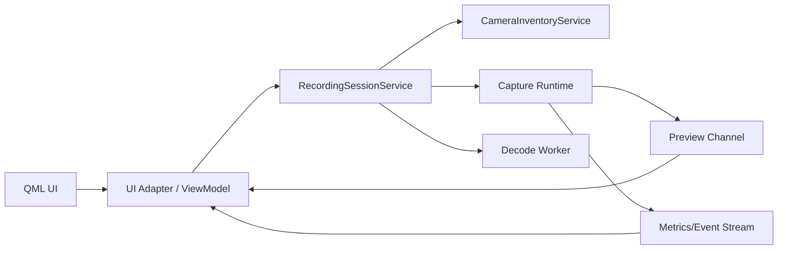

# Native App Runtime Architecture

## 1. Purpose

This document explains the architecture required to turn the redesigned QML UI into a production-ready native application.

It also captures the most important runtime lessons from the legacy Python app, especially around process isolation and preview-versus-recording tradeoffs.

## 2. Current Native Architecture

Today the native app is structured like this:

- `main.cpp` creates `QGuiApplication`, `QQmlApplicationEngine`, `PipelineController`, and `VideoFrameProvider`.
- `PipelineController` owns camera backend selection, ingestion pipeline lifecycle, session state, decode launch, and UI-facing properties.
- `VideoFrameProvider` pulls preview frames from `IngestionPipeline`.
- QML reads controller properties and invokes controller methods directly.

This design is simple, but it has several architectural risks:

- one controller owns too many responsibilities
- the UI contract is tightly coupled to runtime orchestration
- asynchronous decode currently shares controller state directly
- preview policy is implementation-defined rather than architecture-defined
- there is no supervisor boundary if the runtime path becomes unstable

## 3. Legacy Python Architecture

The legacy Python app uses a more defensive runtime split:

- `main_window.py` is the UI shell
- `RecorderThread` is a `QProcess` supervisor
- `recorder_worker.py` owns the live recording runtime
- `_micecam.Pipeline` delegates capture and storage to the C++ core through pybind11 bindings

The most important property is not Python itself. It is the boundary between UI and recording runtime.

If the worker crashes, the UI remains alive and can report failure cleanly.

## 4. Why the Python App Balanced Preview and Recording Better

The Python app treats preview as a degraded side channel rather than a first-class throughput consumer.

### 4.1 Worker-side isolation

The heavy runtime work does not happen in the UI process.

This means:

- capture failures do not automatically take down the UI
- preview work is not mixed into the widget event loop
- the supervisor can reason about worker exit independently

### 4.2 Preview is rate-limited

The Python worker caps preview production to roughly 5 FPS.

This is important because preview does not need recording-grade cadence. It only needs to preserve operator confidence.

### 4.3 Preview is latest-frame-only

The worker uses a queue of size `1`.

That creates a deliberate policy:

- old preview frames are disposable
- preview backlog must not grow
- recording must never wait for preview consumers

### 4.4 Preview fidelity is reduced on purpose

When preview data is raw rather than already JPEG-compressed, the worker extracts a grayscale or luma-only view and downsamples it before sending it to the UI.

This is a production-minded tradeoff:

- lower CPU cost
- lower IPC cost
- lower memory pressure
- acceptable operator signal

### 4.5 Stats are computed outside the UI

The worker aggregates runtime metrics and pushes compact status messages back to the UI.

That keeps the UI reactive without forcing it to infer operational truth from rendering behavior.

## 5. Architectural Principles for the Native App

The native app should preserve the visual redesign, but it should adopt the same runtime principles.

### Principle 1: The UI is not the recording engine

QML should render state and dispatch intent.

It should not be the place where:

- preflight truth is assembled
- background job lifetime is managed
- session transitions are improvised

### Principle 2: Preview is best-effort

Preview must be treated as:

- capped
- droppable
- optionally downscaled
- explicitly disable-able

Preview is a trust aid, not the source of truth for successful recording.

### Principle 3: State transitions must be centralized

The runtime should have a single coordinator or session service that owns:

- device selection
- preflight
- recording start
- stop
- decode
- failure mapping
- shutdown semantics

### Principle 4: Models should be typed

QML should bind to stable models and services rather than raw lists and incidental strings.

Recommended typed boundaries:

- `CameraInventoryModel`
- `CameraCapabilityModel`
- `SessionReadiness`
- `ActivityEventModel`
- `RecordingSessionService`

### Principle 5: Reliability outranks preview polish

Any architectural choice that improves preview smoothness while increasing the risk of dropped frames or shutdown instability is the wrong trade.

## 6. Recommended Target Architecture

## 7. Recommended Native Runtime Layers

### 7.1 UI Adapter Layer

This layer replaces the current controller-heavy pattern with a thin adapter that:

- exposes `Q_PROPERTY` values
- forwards user intent
- subscribes to session updates

It should not directly own camera or decode lifetime.

### 7.2 Session Service Layer

This is the application runtime brain.

Responsibilities:

- lifecycle state machine
- preflight validation
- resource ownership
- async task coordination
- failure translation into operator-facing state

### 7.3 Device and Capability Services

These services own:

- device discovery
- capability lookup
- inventory refresh
- backend-specific translation

### 7.4 Preview Channel

The preview channel should have an explicit contract:

- latest frame wins
- bounded memory
- capped update cadence
- optional reduced-resolution path
- no back-pressure into capture

The existing pull-based `VideoFrameProvider` is directionally good, but it still needs an explicit budget policy and a hardened threading contract.

### 7.5 Activity and Metrics Stream

Instead of `QStringList` logs, the app should expose typed activity events and trustworthy metrics.

Recommended event categories:

- session
- system
- warning
- error
- export

Recommended metrics:

- captured frames
- dropped frames
- actual FPS
- throughput Mbps
- pending buffer depth
- decode progress

## 8. Chosen Runtime Direction

The project has chosen a native worker-process runtime.

This choice follows the product priority order:

- recording stability first
- recovery second
- preview and UI fidelity after that

The supervisor UI process will own:

- operator controls
- QML rendering
- state presentation
- worker supervision
- recovery and restart policy

The worker process will own:

- capture runtime
- camera initialization
- recording pipeline execution
- primary recording-side metrics and events
- degraded or optional preview production

This decision is formalized in [`ADR 0001`](/Users/qiujingyi.7/MiceCam/docs/adr/0001-native-worker-process-runtime.md).

## 9. Current Native Worker Integration

The current implementation now has a concrete supervisor-worker slice in the native app:

- `PipelineController` remains the QML adapter for setup fields and camera capability selection.
- `RecordingSupervisorService` owns lifecycle state, failure mapping, close semantics, and structured activity events.
- `WorkerProcessRuntime` launches the same `micecam_ui` binary in `--worker` mode through `QProcess` and exchanges JSON-line IPC messages.
- `NativeWorkerRuntime` owns camera initialization, recording pipeline execution, decode progression, heartbeat-like stats publication, and safe shutdown sequencing.

This means the app now explicitly handles:

- worker launch failure
- runtime error propagation
- unexpected worker exit
- recording stop and decode transitions
- close requests during decode or stop
- resolved raw/export path reporting back into QML

## 10. Remaining Gaps

The worker-process baseline is now present, but two production gaps still remain:

- preview frames are not yet transported across the worker boundary, so preview currently degrades to an offline/idle experience under the isolated runtime path
- recovery policy is explicit at the state machine level, but it does not yet attempt automatic worker restart or device re-acquisition
## 11. What "Production-Ready" Means Here

For this application, production-ready does not mean "the UI looks finished".

It means:

- the visual system is stable
- the session runtime is reliable
- preview has explicit performance guardrails
- failures are recoverable
- the build and verification story is repeatable
- the architecture is understandable enough for the next feature owner to extend safely

## 11. Backend Gap Analysis: What `internal/` Still Needs

While the core of `internal/` (such as `IngestionPipeline` and lock-free ring buffers) is extremely robust and perfectly matches the "Latest-frame-only" and "Zero-interference" requirements of the new QML UI, there are significant capability gaps that prevent the planned UI from functioning as a true state-driven operational tool.

To achieve the "Apple-like" seamless UX and the ADR-0001 process-isolation, the `internal/` C++ backend must be expanded with the following capabilities:

### 11.1 Real `Preflight` (Validation) Interfaces
**The UX Requirement:** Before clicking "Start", the UI must serve as a dashboard that unequivocally states: "Storage is writable" and "Camera supports this resolution".
**The Backend Gap:** Currently, `internal/camera_backend.h` lacks static or safe pre-initialization query methods. There is no `supportsFormat()` or `getCapabilities()`. The pipeline is instantiated forcefully; if path creation fails or the camera is busy, the pipeline crashes or returns false only *after* the user attempts to start.
**The Fix:** Add strict preflight validation methods to the backend contract so the UI can prevent invalid combinations *before* recording is attempted.

### 11.2 State Machine Projection (Standardized Event Model)
**The UX Requirement:** The QML UI transitions elegantly based on strict states (`idle`, `recording`, `stopping`, `error`) and reacts to health signals (like dropped frames) with clean visual banners, avoiding raw text logs.
**The Backend Gap:** `internal/` currently relies heavily on `std::cout` and `std::cerr` for logging. It does not emit a standardized "Event Bus" or typed alerts (e.g., `DeviceLost`, `FrameDropped(severity)`).
**The Fix:** The backend must stop printing directly to stdout as its primary communication. It needs an `Observer` or structured message queue (IPC-ready) to pump typed event objects back to the Supervisor UI.

### 11.3 Granular Decode Tracking
**The UX Requirement:** During the `decoding` phase, the UI must show a clean, accurate progress transition, allowing the user to seamlessly move to post-recording actions (e.g., "Reveal Output").
**The Backend Gap:** While `micecam::Decoder` supports a callback `cb(float p)`, in a two-process architecture, this callback cannot directly interact with Qt's UI thread.
**The Fix:** Decode progress must be packaged into the same IPC/Event mechanism as runtime stats, allowing the Headless Worker to report `[Decode Progress: 45%]` safely across process boundaries to the QML Supervisor.
